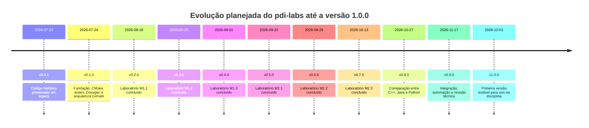

# Changelog

Todas as alterações relevantes deste projeto serão documentadas neste arquivo.

O formato é baseado em [Keep a Changelog](https://keepachangelog.com/pt-BR/1.1.0/),
e este projeto adota [Versionamento Semântico](https://semver.org/lang/pt-BR/).

## Linha do tempo planejada

As datas posteriores à versão `v0.0.1` são marcos de planejamento e poderão ser
ajustadas conforme a validação dos incrementos e o andamento da disciplina.

## [Unreleased]

### Added

- Primeiro componente do Laboratório M1.1: inspeção manual de imagens `CV_8UC1` e `CV_8UC3`.
- Registros tipados para estatísticas globais e estatísticas BGR por canal.
- Testes unitários com imagens sintéticas pequenas e documentação conceitual do Laboratório M1.1.
- Cópia manual profunda de imagens `CV_8UC1` e `CV_8UC3`, com validação e testes de independência.
- Separação manual dos canais B, G e R, com exemplo executável e saídas identificadas.

## [0.1.0] - 2026-07-24

### Added

- Fundação inicial do novo repositório.
- Regras de codificação, formatação e organização de diretórios.
- Metadados legais e acadêmicos do projeto.
- Sistema de build com CMake e presets para MSYS2 UCRT64.
- Biblioteca mínima `pdi_core` e executável `pdi_info`.
- Infraestrutura de testes com Catch2 e CTest.
- Helpers para comparação exata e aproximada de matrizes OpenCV.
- Geração de documentação HTML com Doxygen e Graphviz opcional.
- Arquitetura comum com validação de imagens e saturação para `[0, 255]`.
- Normalização de arquivos textuais com finais de linha LF por `.gitattributes`.

### Changed

- Padronizado o percurso futuro de imagens com ponteiros de linha.
- Definido acesso direto a imagens de um e três canais, sem laço adicional de
  canais.
- Incluída a documentação narrativa completa no conjunto de entradas do
  Doxygen.

## [0.0.1] - 2026-07-23

### Changed

- Renomeado o repositório de `vision_dl` para `pdi-labs`.
- Renomeado o branch principal de `master` para `main`.
- Preservado integralmente o conteúdo do projeto anterior em `legacy/`.

[Unreleased]: https://github.com/m4rc3lo/pdi-labs/compare/v0.1.0...HEAD
[0.1.0]: https://github.com/m4rc3lo/pdi-labs/compare/v0.0.1...v0.1.0
[0.0.1]: https://github.com/m4rc3lo/pdi-labs/releases/tag/v0.0.1
