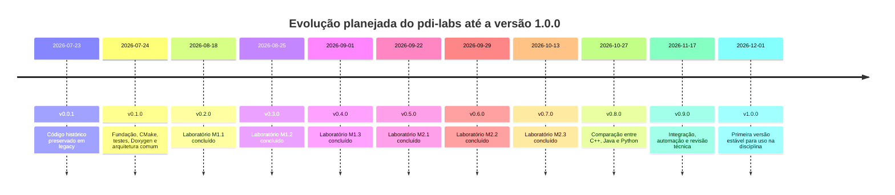

# Changelog

Todas as alterações relevantes deste projeto serão documentadas neste arquivo.

O formato é baseado em [Keep a Changelog](https://keepachangelog.com/pt-BR/1.1.0/),
e este projeto adota [Versionamento Semântico](https://semver.org/lang/pt-BR/).

## Linha do tempo planejada

As datas posteriores à versão `v0.0.1` são marcos de planejamento e poderão ser
ajustadas conforme a validação dos incrementos e o andamento da disciplina.

```mermaid
timeline
    title Evolução planejada do pdi-labs até a versão 1.0.0
    2026-07-23 : v0.0.1
               : Código histórico preservado em legacy
    2026-07-24 : v0.1.0
               : Fundação, CMake, testes, Doxygen e arquitetura comum
    2026-08-18 : v0.2.0
               : Laboratório M1.1 concluído
    2026-08-25 : v0.3.0
               : Laboratório M1.2 concluído
    2026-09-01 : v0.4.0
               : Laboratório M1.3 concluído
    2026-09-22 : v0.5.0
               : Laboratório M2.1 concluído
    2026-09-29 : v0.6.0
               : Laboratório M2.2 concluído
    2026-10-13 : v0.7.0
               : Laboratório M2.3 concluído
    2026-10-27 : v0.8.0
               : Comparação entre C++, Java e Python
    2026-11-17 : v0.9.0
               : Integração, automação e revisão técnica
    2026-12-01 : v1.0.0
               : Primeira versão estável para uso na disciplina
```

## [Unreleased]

### Changed

- Identificadores de páginas e seções da fonte Doxygen derivada passam a ser
  únicos, determinísticos e hierárquicos, inclusive para títulos repetidos.
- Notas que substituem diagramas Mermaid passam a formar blockquotes isolados e
  válidos na documentação publicada.
- Delimitadores matemáticos de bloco são adaptados somente na fonte derivada
  para a sintaxe reconhecida pelo Doxygen.
- Documentação de `SpatialConvolution::convolution` e
  `SpatialConvolution::convolution_raw` foi reassociada às declarações corretas,
  eliminando parâmetros duplicados no Doxygen.

## [0.8.0] - 2026-07-30

### Added

- Comparação didática entre C++, Java e Python para os laboratórios, cobrindo
  estrutura de projeto, tipos, saturação, acesso pixel a pixel, memória,
  persistência, interfaces, testes, desempenho e equivalências conceituais.
- Publicação da comparação no GitHub Pages por meio da fonte documental
  derivada, preservando Mermaid somente nos Markdown canônicos do repositório.
- Manifesto explícito de páginas públicas e página inicial específica para a
  documentação didática publicada no GitHub Pages.
- Testes unitários do preparador documental para seleção, transformação e
  validação da fonte temporária.
- Preparador de fontes Doxygen que preserva Mermaid em `docs/`, cria uma cópia
  temporária específica para o GitHub Pages e liga cada diagrama omitido ao
  documento Markdown original.
- Configuração `PDI_DOCUMENTATION_SOURCE_DIR` para selecionar a fonte narrativa
  processada pelo Doxygen sem alterar a documentação canônica.
- Workflow do GitHub Actions para gerar a documentação Doxygen em Ubuntu e
  publicá-la diretamente no GitHub Pages, com permissões mínimas, validação da
  raiz do artefato e implantação pelo ambiente `github-pages`.
- Instruções detalhadas de habilitação, execução e diagnóstico da publicação da
  documentação no GitHub Pages.
- Galerias com resultados processados curados dos seis laboratórios, incluindo
  comandos reais, parâmetros, métricas resumidas e casos favoráveis ou
  desafiadores selecionados manualmente.
- Coleção de imagens realistas geradas por IA organizada por laboratório para
  demonstrações didáticas futuras.
- Política pública de imagens com catálogo, diretrizes editoriais e registro
  de atribuições para fotografias próprias, imagens realistas geradas por IA e
  imagens redistribuídas da documentação do OpenCV.
- Galeria responsiva para Doxygen com miniaturas clicáveis, estilo visual
  próprio e exemplo completo no Laboratório M1.1.

### Changed

- Preparação documental passa a remover código inline de todos os títulos
  públicos, evitando elementos `<tt>` na navegação e nos cabeçalhos Doxygen.
- Links relativos entre páginas Markdown públicas passam a ser convertidos em
  referências Doxygen estáveis, inclusive quando apontam para seções.
- Versão do projeto e metadados de citação preparados para `v0.8.0`.
- README atualizado com acesso à comparação entre linguagens.
- Curadoria do site baseada em lista de inclusão, mantendo build, testes e
  convenções documentais somente no repositório.
- Títulos formados exclusivamente por nomes técnicos entre crases normalizados
  na cópia Doxygen, evitando elementos `<tt>` em cabeçalhos públicos.
- Recursos de imagem copiados para dentro da raiz HTML publicada, com caminhos
  de galeria adaptados somente na representação temporária usada pelo Pages.
- Publicação Doxygen separada da fonte Markdown canônica para evitar Mermaid
  cru no site sem remover os diagramas que o GitHub já renderiza corretamente.
- Imagens de entrada reorganizadas por origem em fotografias próprias, imagens
  realistas geradas por IA e materiais de terceiros provenientes do OpenCV.
- Organização documental do projeto para explicitar categorias editoriais,
  resultados curados e restrições sobre URLs privadas, arquivos ZIP e
  duplicação desnecessária de originais.

## [0.7.0] - 2026-07-28

### Added

- Erosão e dilatação binárias manuais para imagens `CV_8UC1`, elementos
  estruturantes `3 x 3`, estratégia de borda externa como fundo, testes
  exatos e documentação inicial do Laboratório M2.3.
- Abertura e fechamento por composição das implementações manuais existentes,
  com testes de ordem operacional e exemplos visuais.
- Pipeline morfológico configurável com métricas de área e componentes,
  rastreamento de componentes removidos, matrizes intermediárias em YAML,
  presets justificados e validação opcional com OpenCV.
- Executável integrado `lab_m2_3`, seleção de sequência e elemento
  estruturante, relatórios quantitativos, imagens intermediárias, execução
  opcionalmente gráfica e persistência completa em `ProcessingRecord`.
- Testes de integração e documentação de fechamento do Laboratório M2.3.

### Changed

- Versão do projeto preparada para `v0.7.0`.

## [0.6.0] - 2026-07-27

### Added

- Rotulação manual de componentes conexos com BFS explícita, conectividade 4
  e 8, matriz de rótulos `CV_32SC1` e fundo reservado ao rótulo zero.
- Seleção desacoplada de componente por rótulo, testes com imagens sintéticas
  e documentação de conectividade e complexidade para o Laboratório M2.2.
- Extração manual de área, caixa delimitadora e centroide por componente,
  exportação CSV e rastreabilidade complementar por `ProcessingRecord`.
- Visualização colorida determinística de rótulos em `labels.png`,
  geração de `components.csv`, persistência opcional da matriz de rótulos e
  parâmetros em YAML e comparação opcional com OpenCV para validação
  estrutural.
- Executável final `lab_m2_2` com `--show`, `--interactive`, `--save-data`,
  conectividade configurável, inspeção por mouse e testes de integração.
- Degradação segura sem Qt ou sem infraestrutura interativa compilada.

### Changed

- Versão do projeto preparada para `v0.6.0`.

## [0.5.0] - 2026-07-26

### Added

- Executável integrado `lab_m2_1` para limiarização manual, operações com
  máscaras, HSV, Otsu, limiarização adaptativa, transformada de distância e
  Watershed.
- Pipeline `M21Pipeline`, com separação entre saídas visuais, parâmetros e
  artefatos numéricos persistidos em YAML.
- Suporte opcional a `--show`, `--interactive` e `--save-data` no fechamento
  do Laboratório M2.1.
- Testes de integração e documentação consolidada do Laboratório M2.1.

### Changed

- Versão do projeto preparada para `v0.5.0`.

## [0.4.0] - 2026-07-25

### Added

- Núcleo genérico `SpatialConvolution::convolution` para imagens `CV_8UC1`,
  kernels flutuantes ímpares e política inicial de vizinhança completa.
- Documentação explícita da correlação espacial sem rotação do kernel,
  normalização opcional, complexidade e testes com matrizes pequenas.
- Estratégias determinísticas `CopyBorder` e `ReplicateBorder`, sem uso de
  `cv::copyMakeBorder`.
- Filtros de média `3 x 3`, média ponderada `3 x 3` e média `5 x 5`,
  implementados sobre `SpatialConvolution`, com exemplo e testes.
- Resposta Laplaciana assinada, kernels de quatro e oito vizinhos, realce com
  fator configurável e visualização normalizada da resposta bruta.
- Operador Sobel manual com gradientes assinados `Gx` e `Gy`, magnitudes
  aproximada e euclidiana, visualizações e testes numéricos.
- Executável integrado `lab_m1_3`, seleção de operação e borda, parâmetros,
  imagens sintéticas, saídas identificadas e testes de integração.
- Persistência genérica em YAML com `ProcessingRecord` e
  `ProcessingDataStorage`.
- Opção `--save-data` para parâmetros, kernels e matrizes numéricas do M1.3,
  com testes de round-trip e preparação para experimentos em lote.

## [0.3.0] - 2026-07-24

### Added

- Estudo de caso preliminar do Laboratório M1.2 para simplificação de zonas
  de iluminação com conversão ponderada e quantização.
- Conjunto inicial de imagens sintéticas PPM, relatório CSV, documentação de
  riscos, limitações, próximos passos e equivalências em Java e Python.

## [0.2.0] - 2026-07-24

### Added

- Primeiro componente do Laboratório M1.1: inspeção manual de imagens `CV_8UC1` e `CV_8UC3`.
- Registros tipados para estatísticas globais e estatísticas BGR por canal.
- Testes unitários com imagens sintéticas pequenas e documentação conceitual do Laboratório M1.1.
- Cópia manual profunda de imagens `CV_8UC1` e `CV_8UC3`, com validação e testes de independência.
- Separação manual dos canais B, G e R, com exemplo executável e saídas identificadas.
- Conversões manuais para níveis de cinza por média simples e média ponderada.

- Infraestrutura compartilhada `pdi::io` para leitura, persistência e
  exibição opcional de imagens.
- Opção `--show` nos exemplos de canais e níveis de cinza, mantendo execução
  headless por padrão.
- Política explícita de versionamento para `images/synthetic`, `images/input`
  e `images/output`.

- Quantização manual de imagens `CV_8UC1` para 2, 4, 8, 16 e 256 níveis,
  com reconstrução uniforme, testes de fronteira e exemplo opcionalmente gráfico.
- Executável integrado `lab_m1_1`, relatório CSV, README específico e testes
  de integração para o fluxo completo do laboratório.

## [0.1.0] - 2026-07-24

### Added

- Fundação inicial do novo repositório.
- Regras de codificação, formatação e organização de diretórios.
- Metadados legais e acadêmicos do projeto.
- Sistema de build com CMake e presets para MSYS2 UCRT64.
- Biblioteca mínima `pdi_core` e executável `pdi_info`.
- Infraestrutura de testes com Catch2 e CTest.
- Helpers para comparação exata e aproximada de matrizes OpenCV.
- Geração de documentação HTML com Doxygen e Graphviz opcional.
- Arquitetura comum com validação de imagens e saturação para `[0, 255]`.
- Normalização de arquivos textuais com finais de linha LF por `.gitattributes`.

### Changed

- Galerias ajustadas para caminhos relativos da saída Doxygen/GitHub Pages,
  sem conflito de classes nas tags de imagem, e diagramas Mermaid padronizados
  com a paleta institucional registrada no próprio código.
- Padronizado o percurso futuro de imagens com ponteiros de linha.
- Definido acesso direto a imagens de um e três canais, sem laço adicional de
  canais.
- Incluída a documentação narrativa completa no conjunto de entradas do
  Doxygen.

## [0.0.1] - 2026-07-23

### Changed

- Renomeado o repositório de `vision_dl` para `pdi-labs`.
- Renomeado o branch principal de `master` para `main`.
- Preservado integralmente o conteúdo do projeto anterior em `legacy/`.

[Unreleased]: https://github.com/m4rc3lo/pdi-labs/compare/v0.6.0...HEAD
[0.6.0]: https://github.com/m4rc3lo/pdi-labs/compare/v0.5.0...v0.6.0
[0.5.0]: https://github.com/m4rc3lo/pdi-labs/compare/v0.4.0...v0.5.0
[0.4.0]: https://github.com/m4rc3lo/pdi-labs/compare/v0.3.0...v0.4.0
[0.3.0]: https://github.com/m4rc3lo/pdi-labs/compare/v0.2.0...v0.3.0
[0.2.0]: https://github.com/m4rc3lo/pdi-labs/compare/v0.1.0...v0.2.0
[0.1.0]: https://github.com/m4rc3lo/pdi-labs/compare/v0.0.1...v0.1.0
[0.0.1]: https://github.com/m4rc3lo/pdi-labs/releases/tag/v0.0.1
