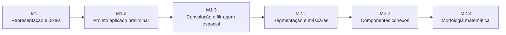
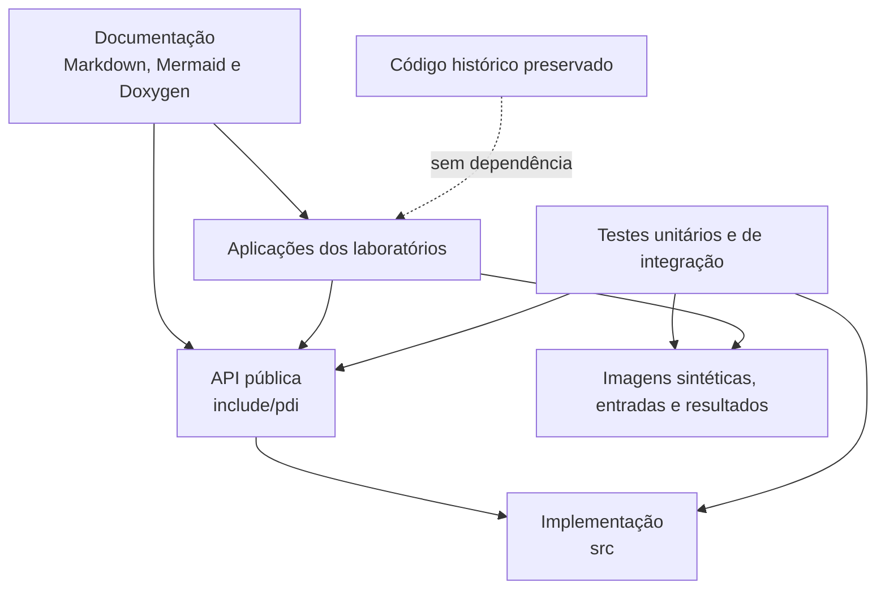

# pdi-labs

Implementações didáticas em C++ e OpenCV para os laboratórios da disciplina de
Processamento de Imagens, com documentação Doxygen, diagramas Mermaid e testes
reproduzíveis.

O projeto está sendo construído de forma incremental para apoiar o estudo de
representação de imagens, operações no domínio do valor, processamento espacial,
segmentação, componentes conexos e morfologia matemática. O código e o sistema de
build devem permanecer compatíveis com Windows e Linux.

## Contexto acadêmico

Este repositório é parte da organização da disciplina de Processamento de Imagens
para o semestre 2026-02. O material foi planejado para apoiar atividades práticas
individuais, com ênfase em:

- compreensão da representação computacional de imagens;
- implementação explícita de algoritmos;
- acesso pixel a pixel;
- análise de resultados;
- tratamento de limites, saturação e bordas;
- modularização;
- documentação técnica;
- testes automatizados;
- reprodutibilidade.

As implementações em C++ funcionam como referência didática. Elas não substituem
a leitura dos roteiros dos laboratórios, a compreensão das fórmulas ou a análise
crítica dos resultados.

## Objetivos didáticos

O repositório deverá permitir que o estudante:

1. relacione imagens digitais a matrizes, canais, tipos e intervalos numéricos;
2. implemente operações pontuais e de vizinhança sem depender de funções prontas;
3. compreenda o efeito de parâmetros, kernels e políticas de borda;
4. valide resultados com imagens sintéticas de pequena dimensão;
5. compare resultados manuais com implementações de biblioteca quando isso for
   pedagogicamente permitido;
6. organize código científico e educacional de forma modular, documentada e
   testável;
7. discuta adaptações equivalentes em C++, Java e Python.

## Implementações de referência

O código deste repositório é uma implementação de referência para estudo,
demonstração e validação.

Os exemplos devem ser utilizados para:

- compreender a decomposição dos algoritmos;
- estudar decisões de projeto;
- reproduzir experimentos;
- comparar estratégias;
- observar boas práticas de documentação e testes.

O uso do repositório não elimina a necessidade de autoria individual nas
entregas avaliativas. Cada estudante deve seguir as regras específicas da
disciplina e declarar fontes, adaptações e referências utilizadas.

## Restrição de funções prontas

Nos laboratórios em que o objetivo é compreender a implementação do algoritmo,
o OpenCV será utilizado principalmente como infraestrutura para:

- leitura de imagens;
- escrita de imagens;
- armazenamento em `cv::Mat`;
- consulta de dimensões, canais e tipos;
- acesso e modificação de pixels;
- criação de imagens de saída.

Funções prontas que executem diretamente a operação estudada não deverão ser
utilizadas na implementação manual correspondente.

Exemplos de funções restritas em etapas específicas:

```cpp
cv::cvtColor();
cv::threshold();
cv::equalizeHist();
cv::normalize();
cv::filter2D();
cv::blur();
cv::GaussianBlur();
cv::medianBlur();
cv::Sobel();
cv::Laplacian();
cv::Canny();
cv::split();
cv::merge();
cv::calcHist();
cv::erode();
cv::dilate();
```

A restrição é contextual. Alguns laboratórios posteriores poderão utilizar
funções prontas para comparação, validação ou estudo de métodos que não serão
reimplementados integralmente.

## Visão geral dos laboratórios



| Laboratório | Média | Tema | Principais algoritmos e atividades |
|---|---:|---|---|
| M1.1 | M1 | Representação e acesso a pixels | inspeção, cópia manual, separação de canais, níveis de cinza e quantização |
| M1.2 | M1 | Proposta preliminar de projeto aplicado | definição do problema, dados iniciais, pipeline, protótipo e resultados preliminares |
| M1.3 | M1 | Processamento espacial | convolução, políticas de borda, filtros de média, Laplaciano e Sobel |
| M2.1 | M2 | Segmentação e máscaras | limiarização, seleção por intervalo, máscaras, Otsu, limiarização adaptativa, distância e Watershed |
| M2.2 | M2 | Componentes conexos | BFS ou DFS, conectividade 4 e 8, rotulação, área, caixa delimitadora e centroide |
| M2.3 | M2 | Morfologia matemática | erosão, dilatação, abertura, fechamento e sequências morfológicas justificadas |

## Convenção: convolução e correlação espacial

Neste projeto, o termo **convolução** é utilizado por convenção didática e de
API.

A implementação aplica o kernel sem rotação de 180 graus. Portanto, do ponto de
vista matemático, a operação executada é uma **correlação espacial**.

Para os kernels ímpares e simétricos utilizados nos laboratórios, correlação
espacial e convolução matemática produzem o mesmo resultado numérico. Essa
distinção será registrada na documentação das classes e dos métodos relevantes.

## Tecnologias principais

- C++20;
- OpenCV;
- CMake;
- CTest;
- Catch2 3;
- Doxygen;
- Graphviz, quando disponível;
- Markdown;
- Mermaid;
- Git;
- GitHub;
- MSYS2 UCRT64;
- Visual Studio Code.

Algumas dependências e targets ainda serão adicionados durante a evolução do
projeto.

## Requisitos de ambiente

Os ambientes principais de desenvolvimento e validação são:

- Windows 10 ou Windows 11 com MSYS2 UCRT64;
- distribuições Linux com GCC ou Clang;
- CMake 3.24 ou superior;
- Ninja ou Make;
- OpenCV disponível para o compilador selecionado;
- Git;
- Visual Studio Code, opcional;
- extensão CMake Tools, quando o Visual Studio Code for utilizado;
- extensão C/C++, quando o Visual Studio Code for utilizado;
- Doxygen, para geração da documentação;
- Graphviz, opcional para diagramas gerados pelo Doxygen.

Todo artefato de configuração e compilação deve ser gerado dentro de `build/`,
na raiz do projeto. Esse diretório não é versionado.

## Preparação inicial dos ambientes

### Windows com MSYS2 UCRT64

Abra o terminal **MSYS2 UCRT64** e atualize os pacotes:

```bash
pacman -Syu
```

Quando o terminal solicitar reinicialização, feche-o, abra novamente o terminal
UCRT64 e conclua:

```bash
pacman -Syu
```

Instale as ferramentas principais:

```bash
pacman -S --needed \
    git \
    make \
    mingw-w64-ucrt-x86_64-gcc \
    mingw-w64-ucrt-x86_64-cmake \
    mingw-w64-ucrt-x86_64-ninja \
    mingw-w64-ucrt-x86_64-opencv \
    mingw-w64-ucrt-x86_64-doxygen \
    mingw-w64-ucrt-x86_64-graphviz
```

Confirme o ambiente:

```bash
gcc --version
g++ --version
cmake --version
ninja --version
pkg-config --modversion opencv4
doxygen --version
git --version
```


### Linux

Em distribuições baseadas em Debian ou Ubuntu, instale as dependências
equivalentes:

```bash
sudo apt update
sudo apt install \
    build-essential \
    cmake \
    ninja-build \
    git \
    libopencv-dev \
    doxygen \
    graphviz
```

Confirme o ambiente:

```bash
g++ --version
cmake --version
ninja --version
pkg-config --modversion opencv4
doxygen --version
git --version
```

Em outras distribuições, utilize os pacotes equivalentes fornecidos pelo
gerenciador do sistema.

## Uso com Visual Studio Code

Abra o repositório a partir do terminal UCRT64:

```bash
code .
```

Extensões recomendadas:

- C/C++;
- CMake Tools;
- Doxygen Documentation Generator;
- Mermaid Markdown Syntax Highlighting;
- Markdown Preview Mermaid Support.

A configuração definitiva do CMake e dos presets será adicionada em incrementos
posteriores.

## Estrutura resumida do repositório

```text
pdi-labs/
├── .editorconfig
├── .clang-format
├── .gitattributes
├── .gitignore
├── LICENSE
├── NOTICE
├── README.md
├── CITATION.cff
├── CHANGELOG.md
├── cmake/
├── docs/
│   ├── images/
│   └── labs/
├── include/
│   └── pdi/
├── src/
├── apps/
├── tests/
│   ├── unit/
│   ├── integration/
│   ├── fixtures/
│   └── expected/
├── images/
│   ├── synthetic/
│   ├── input/
│   └── output/
├── scripts/
└── legacy/
```

A estrutura será expandida à medida que os componentes forem implementados.

## Arquitetura conceitual



O diretório `legacy/` é mantido apenas como registro histórico e não deverá
compor a arquitetura do código novo.

## Configuração, compilação e testes

O projeto usa CMake 3.24 ou superior, C++20 e compilação fora dos diretórios de
código-fonte. Todos os artefatos devem permanecer em `build/`.

### MSYS2 UCRT64 com presets

Liste os presets disponíveis:

```bash
cmake --list-presets
```

Configure e compile em Debug:

```bash
cmake --preset ucrt64-debug
cmake --build --preset ucrt64-debug
```

Execute o utilitário de informações:

```bash
./build/ucrt64-debug/pdi_info.exe
```

Configure e compile em Release:

```bash
cmake --preset ucrt64-release
cmake --build --preset ucrt64-release
```

```bash
./build/ucrt64-release/pdi_info.exe
```

### Linux

A configuração manual mantém o mesmo layout dentro de `build/`:

```bash
cmake -S . -B build/linux-debug \
    -G Ninja \
    -DCMAKE_BUILD_TYPE=Debug \
    -DPDI_BUILD_TESTS=ON \
    -DPDI_BUILD_DOCS=OFF \
    -DPDI_BUILD_EXAMPLES=ON
```

```bash
cmake --build build/linux-debug
```

```bash
./build/linux-debug/pdi_info
```

Para Release:

```bash
cmake -S . -B build/linux-release \
    -G Ninja \
    -DCMAKE_BUILD_TYPE=Release \
    -DPDI_BUILD_TESTS=ON \
    -DPDI_BUILD_DOCS=OFF \
    -DPDI_BUILD_EXAMPLES=ON
```

```bash
cmake --build build/linux-release
```

A infraestrutura usa Catch2 3 integrado ao CTest. Os testes são separados em
`tests/unit/` e `tests/integration/`. Para executar todos os testes:

```bash
ctest \
    --test-dir build/ucrt64-debug \
    --output-on-failure
```

No Linux, substitua o diretório pelo build utilizado, por exemplo:

```bash
ctest \
    --test-dir build/linux-debug \
    --output-on-failure
```

As opções disponíveis são:

| Opção | Padrão | Finalidade |
|---|---:|---|
| `PDI_BUILD_TESTS` | `ON` | habilita a infraestrutura de testes |
| `PDI_BUILD_DOCS` | `OFF` | prepara a geração da documentação |
| `PDI_BUILD_EXAMPLES` | `ON` | compila aplicações e exemplos |
| `PDI_FETCH_TEST_DEPENDENCIES` | `ON` | permite obter Catch2 quando ele não estiver instalado |


### Dependência de testes e modo offline

O projeto procura primeiro uma instalação compatível do Catch2 3. Quando ela não
é encontrada e `PDI_FETCH_TEST_DEPENDENCIES=ON`, o CMake utiliza `FetchContent`
para obter a versão fixada no projeto.

Para configurar sem permitir downloads:

```bash
cmake -S . -B build/offline-debug \
    -G Ninja \
    -DCMAKE_BUILD_TYPE=Debug \
    -DPDI_BUILD_TESTS=ON \
    -DPDI_FETCH_TEST_DEPENDENCIES=OFF
```

Nesse modo, Catch2 3 precisa estar previamente instalado e visível ao CMake. Caso
contrário, a configuração falhará com uma mensagem indicando as alternativas.

Também é possível desabilitar completamente os testes:

```bash
cmake -S . -B build/no-tests \
    -G Ninja \
    -DPDI_BUILD_TESTS=OFF
```

### Execução seletiva

Liste os testes registrados:

```bash
ctest --test-dir build/ucrt64-debug --show-only
```

Execute apenas testes unitários:

```bash
ctest \
    --test-dir build/ucrt64-debug \
    --tests-regex '^unit\.' \
    --output-on-failure
```

Execute apenas testes de integração:

```bash
ctest \
    --test-dir build/ucrt64-debug \
    --tests-regex '^integration\.' \
    --output-on-failure
```

## Documentação Doxygen

A documentação da API pública será escrita com os principais recursos do
Doxygen:

- `@file`;
- `@brief`;
- `@details`;
- `@param`;
- `@return`;
- `@throws`;
- `@pre`;
- `@post`;
- `@note`;
- `@warning`;
- `@see`;
- `@code`;
- `@endcode`.

A geração planejada será:

```bash
cmake -S . -B build/ucrt64-docs \
    -G Ninja \
    -DPDI_BUILD_DOCS=ON
```

```bash
cmake --build build/ucrt64-docs --target docs
```

A documentação narrativa dos laboratórios será mantida em `docs/labs/`.

## Convenções de código

As convenções principais são:

- classes, interfaces, enumerações, registros e namespaces em inglês;
- classes, interfaces, enumerações e registros em `CamelCase`;
- métodos, funções, variáveis, parâmetros e campos em `snake_case`;
- nomes de arquivos em inglês;
- nome do arquivo correspondente ao tipo principal;
- uma classe pública principal por arquivo;
- indentação com quatro espaços;
- tabulações proibidas em arquivos novos;
- codificação UTF-8;
- finais de linha LF, reforçados por `.gitattributes`;
- extensões em minúsculas;
- comentários Doxygen nas APIs públicas.

Exemplo:

```cpp
namespace pdi::spatial {

class SpatialConvolution {
public:
    cv::Mat apply_convolution(
        const cv::Mat& input_image,
        const cv::Mat& kernel
    ) const;
};

} // namespace pdi::spatial
```

## Fluxo de desenvolvimento


Fluxo básico:

```bash
git switch main
git pull --ff-only
git switch -c tipo/nome-da-alteracao
git apply ../laboratorios/nome-do-patch.patch
```

Depois da validação:

```bash
git add --all
git commit -m "tipo: descrição da alteração"
git switch main
git merge --no-ff tipo/nome-da-alteracao \
    -m "merge: descrição da alteração"
git push origin main
git branch -d tipo/nome-da-alteracao
```

## Política de contribuições

As contribuições devem:

- preservar os objetivos didáticos;
- manter implementações manuais quando exigidas;
- incluir testes;
- atualizar a documentação;
- respeitar as convenções de código;
- evitar dependências desnecessárias;
- não introduzir caminhos absolutos;
- não incluir arquivos pessoais ou artefatos de build;
- registrar fontes e adaptações;
- preservar a compatibilidade com MSYS2 UCRT64.

Mudanças devem ser pequenas, revisáveis e associadas a uma finalidade clara.

## Licença

O código e a documentação original do projeto são disponibilizados sob a
Apache License 2.0.

Consulte:

- `LICENSE`;
- `NOTICE`.

OpenCV, ferramentas, bibliotecas, datasets e outros materiais de terceiros
permanecem sujeitos às respectivas licenças.

## Citação

Os metadados para citação acadêmica estão disponíveis em:

```text
CITATION.cff
```

O projeto não possui DOI registrado neste estágio.

## Histórico preservado

O conteúdo anterior do repositório `vision_dl` foi preservado em:

```text
legacy/
```

Esse diretório mantém o registro do projeto original, mas não define as
convenções, a arquitetura ou a qualidade esperada para o novo código.

## Status atual

Estado atual:

- repositório renomeado para `pdi-labs`;
- branch principal migrado para `main`;
- histórico anterior preservado em `legacy/`;
- versão histórica `v0.0.1` registrada;
- versão de fundação `v0.1.0` concluída;
- estrutura inicial criada;
- convenções básicas definidas;
- metadados legais e acadêmicos adicionados;
- fundação de build configurada com CMake, C++20 e presets UCRT64;
- biblioteca mínima `pdi_core` e executável `pdi_info` adicionados;
- Catch2 integrado ao CTest com testes unitários e de integração;
- helpers para comparação exata e aproximada de `cv::Mat` adicionados;
- documentação Doxygen integrada ao CMake;
- arquitetura comum com validação de `cv::Mat` e saturação adicionada;
- percurso futuro de pixels padronizado com ponteiros de linha;
- finais de linha LF reforçados por `.editorconfig` e `.gitattributes`;
- algoritmos dos laboratórios ainda não implementados.

O projeto encontra-se em construção incremental.

## Roadmap até a versão 1.0.0

| Versão | Marco |
|---|---|
| `v0.0.1` | preservação do projeto histórico em `legacy/` |
| `v0.1.0` | fundação, documentação, CMake, testes e Doxygen |
| `v0.2.0` | Laboratório M1.1 |
| `v0.3.0` | Laboratório M1.2 |
| `v0.4.0` | Laboratório M1.3 |
| `v0.5.0` | Laboratório M2.1 |
| `v0.6.0` | Laboratório M2.2 |
| `v0.7.0` | Laboratório M2.3 |
| `v0.8.0` | comparação entre C++, Java e Python |
| `v0.9.0` | integração, automação e revisão técnica |
| `v1.0.0` | primeira versão estável para uso na disciplina |
