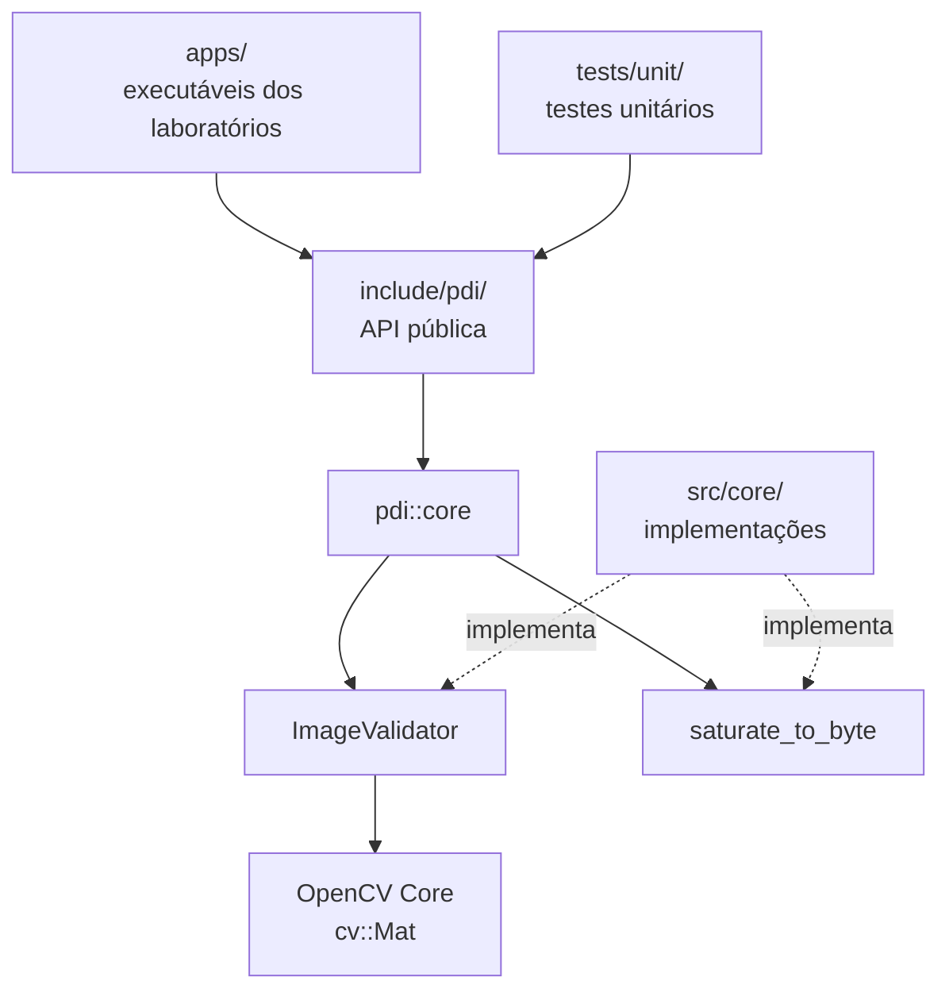

# Arquitetura comum

Este documento apresenta a primeira camada compartilhada do `pdi-labs`. A
arquitetura será ampliada gradualmente, mantendo as dependências direcionadas
das aplicações para as APIs públicas e destas para suas implementações.

## Visão inicial



## Namespaces

O namespace raiz `pdi` identifica os componentes próprios do projeto. A
primeira subdivisão é `pdi::core`, destinada a contratos e utilitários
compartilhados por diferentes laboratórios.

```cpp
namespace pdi::core {
    class ImageValidator;
}
```

Módulos de processamento específicos serão criados posteriormente, sem
concentrar todos os algoritmos no namespace `core`.

## Validação de imagens

`ImageValidator` centraliza pré-condições estruturais de `cv::Mat`:

- imagem não vazia;
- quantidade esperada de canais;
- profundidade `CV_8U`.

As validações não modificam a imagem e lançam `std::invalid_argument` com
mensagens que identificam a condição violada. Os algoritmos posteriores devem
validar suas entradas antes de iniciar o percurso dos pixels.

## Saturação

`saturate_to_byte()` converte resultados numéricos para o intervalo inclusivo
`[0, 255]`. O utilitário:

- limita valores negativos a `0`;
- limita valores acima de `255`;
- arredonda valores intermediários;
- converte `NaN` para `0`;
- trata infinitos pelos limites do intervalo.

A função evita conversões diretas para `uchar` antes do controle de intervalo.

## Percurso de imagens

As implementações manuais dos laboratórios deverão percorrer imagens por
ponteiros de linha, evitando `cv::Mat::at()` nos laços de processamento.

Exemplo para uma imagem em níveis de cinza:

```cpp
for (int row = 0; row < image.rows; ++row) {
    const auto* input_row = image.ptr<std::uint8_t>(row);
    auto* output_row = output_image.ptr<std::uint8_t>(row);

    for (int col = 0; col < image.cols; ++col) {
        output_row[col] = input_row[col];
    }
}
```

Exemplo para uma imagem colorida:

```cpp
for (int row = 0; row < image.rows; ++row) {
    const auto* input_row = image.ptr<cv::Vec3b>(row);

    for (int col = 0; col < image.cols; ++col) {
        const cv::Vec3b pixel = input_row[col];
        // Processamento manual do pixel BGR.
    }
}
```

O ponteiro é obtido uma vez para cada linha. O índice da coluna é aplicado
sobre a linha tipada, preservando a ordem BGR das imagens coloridas do OpenCV.

Para imagens com até três canais, não será criado um laço adicional para
percorrer canais:

- imagens de um canal usam `std::uint8_t*` e acesso direto por `row_ptr[col]`;
- imagens de três canais usam `cv::Vec3b*` e acesso direto por
  `row_ptr[col][0]`, `row_ptr[col][1]` e `row_ptr[col][2]`;
- um laço genérico de canais somente será considerado no futuro para tipos com
  mais de três canais, quando houver requisito explícito para esse formato.

Essa decisão mantém o código dos laboratórios alinhado à representação concreta
dos formatos estudados e torna visível a semântica de cada canal BGR.

## Limites desta etapa

Esta camada não implementa transformações de intensidade, filtros,
segmentação ou morfologia. O OpenCV é utilizado somente para representar a
imagem por `cv::Mat` e consultar suas propriedades estruturais.
