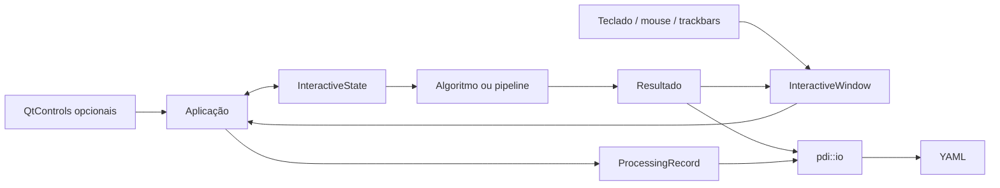
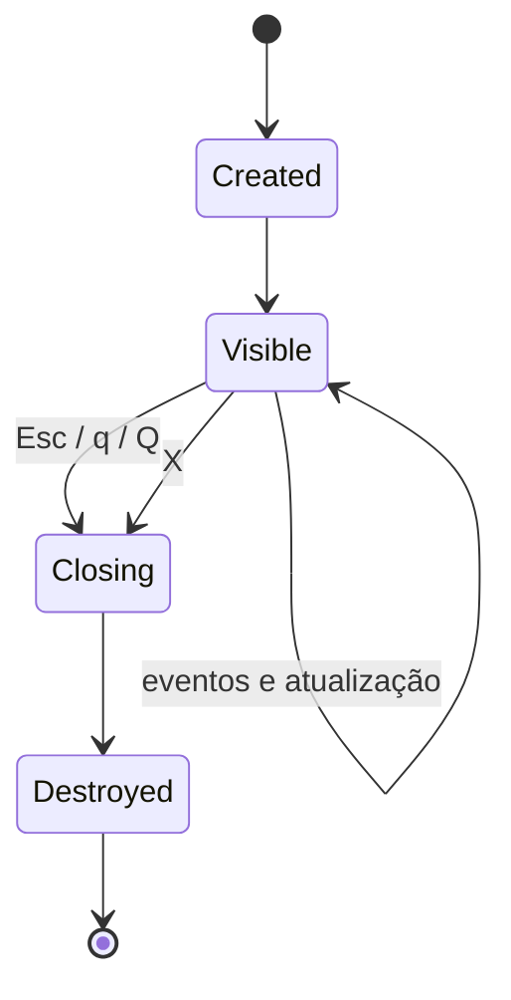

# Infraestrutura interativa opcional

## Objetivo

A camada `pdi::ui` oferece interação responsiva sem acoplar HighGUI, Qt ou
callbacks aos algoritmos e pipelines. O build padrão continua headless.

```text
sem opção       -> processa, salva e encerra
--show          -> visualização estática
--interactive   -> interface responsiva
--save-data     -> persistência YAML independente
```

## Arquitetura



`pdi::ui` coordena interação. O algoritmo recebe parâmetros e produz resultados.
A aplicação decide quando salvar imagens ou montar um `ProcessingRecord`.

## HighGUI básico e Qt

Trackbars, callbacks de mouse, teclado e janelas pertencem ao HighGUI básico.
Botões, checkboxes e radio buttons dependem das extensões Qt acessíveis por
`cv::createButton`.

`UiCapabilities` consulta o backend atual. Quando Qt não está disponível:

- a aplicação continua funcional;
- trackbars, mouse e teclado permanecem utilizáveis quando o HighGUI existe;
- os controles Qt são omitidos;
- nenhuma dependência direta de Qt é adicionada ao projeto.

## Ciclo de vida e laço de eventos

`ImageDisplay` e `InteractiveWindow` evitam `cv::waitKey(0)` como mecanismo
único de espera. As duas abstrações processam eventos periodicamente e
consultam `cv::WND_PROP_VISIBLE` para reconhecer o fechamento pelo botão `X`.
Valores menores que `1.0`, valores negativos e exceções ao consultar uma janela
já destruída são interpretados como encerramento normal.



A política universal de saída reconhece `Esc`, `q` e `Q` antes do callback da
aplicação. Assim, a janela interativa encerra mesmo sem callback registrado, mas
o callback ainda recebe o evento quando existe.

`cv::waitKey` recebe teclado da janela HighGUI em foco. Pressionar `Esc` no
terminal não equivale a pressionar `Esc` na janela.

`InteractiveWindow` não chama novamente `cv::imshow` depois que a janela é
fechada, evitando recriação acidental. Os callbacks são executados no mesmo
fluxo que processa o laço; objetos capturados devem permanecer válidos até o
encerramento.

## Build

O suporte interativo é desligado por padrão:

```bash
cmake --preset ucrt64-debug
cmake --build --preset ucrt64-debug
```

Para habilitar:

```bash
cmake -S . -B build/ucrt64-debug-ui \
    -G Ninja \
    -DCMAKE_BUILD_TYPE=Debug \
    -DPDI_BUILD_INTERACTIVE_UI=ON \
    -DPDI_BUILD_INTERACTIVE_TESTS=ON
```

```bash
cmake --build build/ucrt64-debug-ui
```

O projeto não presume que o OpenCV tenha sido compilado com Qt.

## Testes

Os testes opcionais de estado e eventos não criam janelas e podem ser
executados com CTest no build interativo.

Os executáveis:

```text
pdi_ui_test_trackbar
pdi_ui_test_mouse
pdi_ui_test_keyboard
pdi_ui_test_qt_controls
pdi_ui_test_window_close
```

são diagnósticos manuais e não são registrados no CTest.

## Demonstração M2.1

```bash
./build/ucrt64-debug-ui/lab_m2_1_interactive.exe \
    images/input/example.png \
    images/output/m2_1 \
    --interactive \
    --save-data
```

Controles:

```text
M      alterna global/intervalo
R      redefine parâmetros
S      salva o estado atual
Q/q/Esc encerra
X       encerra o laço
mouse   inspeciona intensidade
```

O YAML é salvo pela aplicação, não por `pdi::ui`, e registra os parâmetros
finais selecionados.

## Limitações

Interfaces HighGUI podem não funcionar em CI, sessões remotas sem display,
containers headless ou instalações do OpenCV sem backend gráfico. Esses
ambientes continuam compatíveis com o build e os testes padrão.


## Fechamento estático e interativo

```text
--show
Esc, q ou Q -> encerra
X           -> fecha uma janela
último X    -> encerra o processo

--interactive
Esc, q ou Q -> encerra
X           -> encerra o laço
```

Quando controles Qt são usados, a aplicação realiza limpeza global ao final
para remover também o painel de controles. Uma instância isolada de
`InteractiveWindow` destrói apenas sua própria janela.
