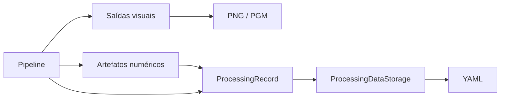

# Persistência de dados de processamento

## Objetivo

`ProcessingDataStorage` registra uma execução de processamento em YAML usando
`cv::FileStorage`. O recurso é voltado a imagens pequenas, verificações
numéricas, depuração e rastreabilidade didática.

PNG, JPEG e PGM continuam sendo saídas visuais. YAML preserva parâmetros,
kernels e matrizes numéricas em seus tipos originais. Uma imagem normalizada
para `CV_8UC1` não substitui uma resposta bruta em ponto flutuante.

## Modelo

`ProcessingRecord` é independente dos laboratórios e contém:

- versão do formato;
- versão do projeto;
- laboratório;
- operação;
- caminho da entrada;
- parâmetros textuais;
- artefatos numéricos identificados.

Um registro pode não possuir matrizes. Isso permite reutilizar a infraestrutura
em operações que precisam registrar apenas parâmetros, estatísticas ou
metadados.

## Fluxo



## Tipos e precisão

A persistência não converte as matrizes. Os testes cobrem:

- `CV_8UC1`;
- `CV_32FC1`;
- `CV_64FC1`;
- valores negativos;
- valores fracionários;
- valores acima de `255`.

Matrizes vazias são rejeitadas. Registros sem artefatos são aceitos.

## Uso

```cpp
pdi::io::ProcessingRecord record{
    .format_version = "1",
    .project_version = PDI_PROJECT_VERSION,
    .laboratory = "M1.3",
    .operation = "sobel",
    .input_path = input_path.string(),
    .parameters = {{"border_strategy", "replicate"}},
    .numeric_artifacts = {
        {"gradient_x", gradient_x},
        {"gradient_y", gradient_y},
    },
};

pdi::io::ProcessingDataStorage{}.save_yaml(
    "images/output/sobel_result.yml",
    record
);
```

A leitura usa `load_yaml` e reconstrói as matrizes com o tipo armazenado.

## Limitações de tamanho

YAML é textual e pode ser muito maior que uma representação binária. O recurso
não é destinado ao armazenamento eficiente de grandes bases. Ele é apropriado
a:

- imagens pequenas;
- testes;
- inspeção de matrizes;
- rastreabilidade;
- reprodução de uma execução.

## Expansão para lote

A classe não contém estado global, nomes fixos ou dependência da CLI. Uma
evolução futura poderá usar:

```cpp
std::vector<pdi::io::ProcessingRecord>
```

para múltiplas entradas, repetições e varreduras de parâmetros. Cada execução
poderá gerar um YAML próprio, acompanhado por um manifesto de lote. O executor
em lote não faz parte desta versão.
