# Catálogo de imagens

Este catálogo reúne as imagens oficiais atualmente versionadas no projeto
`pdi-labs`. Ele distingue entradas, imagens sintéticas, materiais de terceiros
e resultados curados, sempre com finalidade didática.

As miniaturas abaixo são clicáveis e abrem o arquivo em sua resolução natural.
Nesta rodada, o catálogo cobre as **entradas oficiais** já presentes no
repositório. O diretório `docs/images/results/` ainda não possui resultados
curados publicados.

## Legenda editorial

- **Entrada**: imagem usada como insumo de laboratório.
- **Imagem sintética computacional**: imagem criada por código para teste
  controlado.
- **Resultado curado**: saída selecionada manualmente para documentação.
- **Favorável**: caso em que o fenômeno principal aparece de forma mais limpa.
- **Desafiadora**: caso com ruído, sombra, textura, sobreposição ou maior
  ambiguidade.

## Galeria rápida por laboratório

Clique em qualquer miniatura para abrir o arquivo original em sua resolução
natural. As imagens são exibidas integralmente, sem corte ou deformação.

<a class="pdi_gallery_link" href="../images/input/ai_realistic/m1_1/m1_1_a_rgb_quantizacao.png">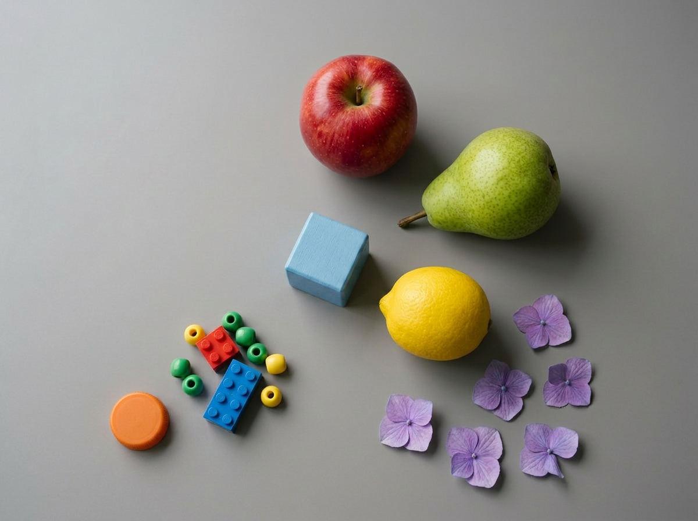</a>

<strong>M1.1 — Caso A</strong> Entrada favorável para canais, escala de cinza e quantização.

<a class="pdi_gallery_link" href="../images/input/ai_realistic/m1_1/m1_1_b_rgb_quantizacao.png">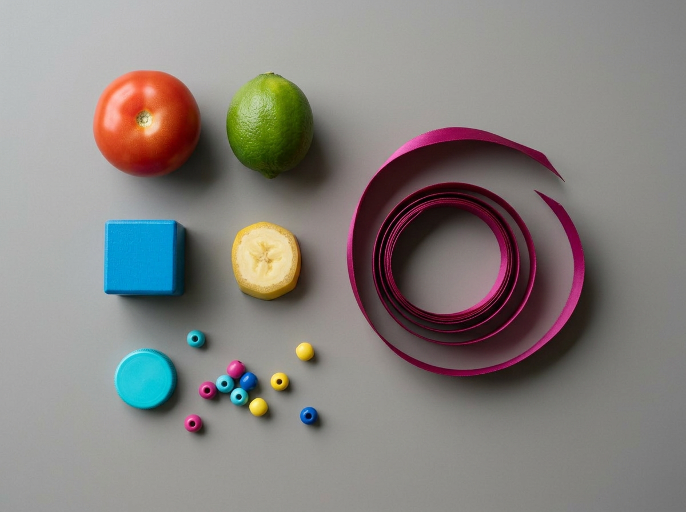</a>

<strong>M1.1 — Caso B</strong> Entrada desafiadora para perda tonal e preservação de detalhes.

<a class="pdi_gallery_link" href="../images/input/ai_realistic/m1_2/m1_2_a_dominio_valor.png">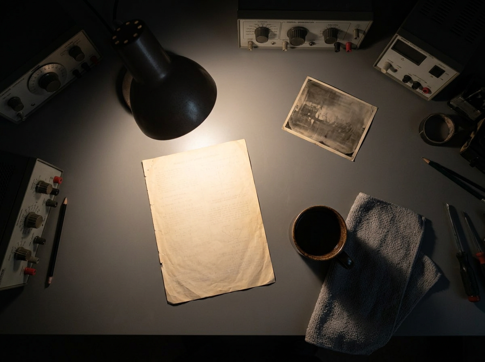</a>

<strong>M1.2 — Caso A</strong> Entrada favorável para estudo preliminar no domínio do valor.

<strong>M1.2 — Caso B</strong> Entrada desafiadora com regiões tonalmente próximas.

<a class="pdi_gallery_link" href="../images/input/ai_realistic/m1_3/m1_3_a_espacial_bordas.png">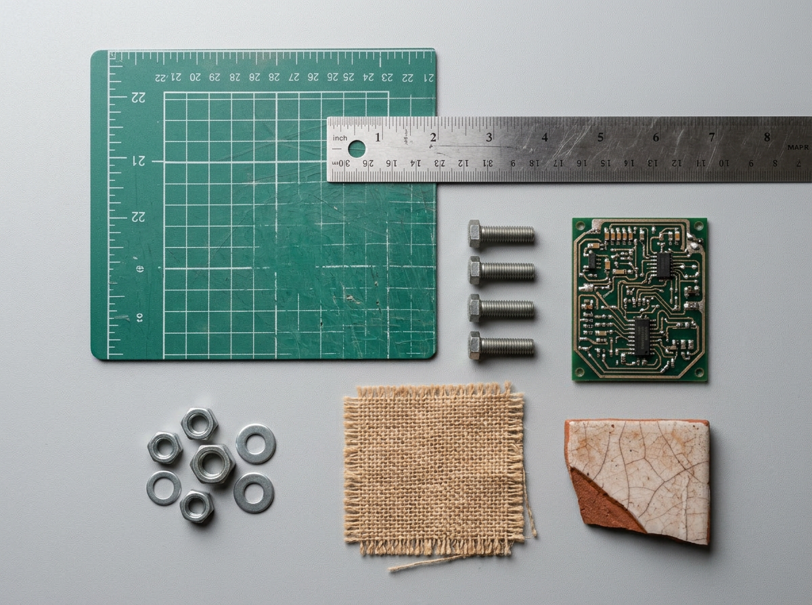</a>

<strong>M1.3 — Caso A</strong> Entrada favorável para suavização, realce e bordas.

<a class="pdi_gallery_link" href="../images/input/ai_realistic/m1_3/m1_3_b_espacial_bordas.png">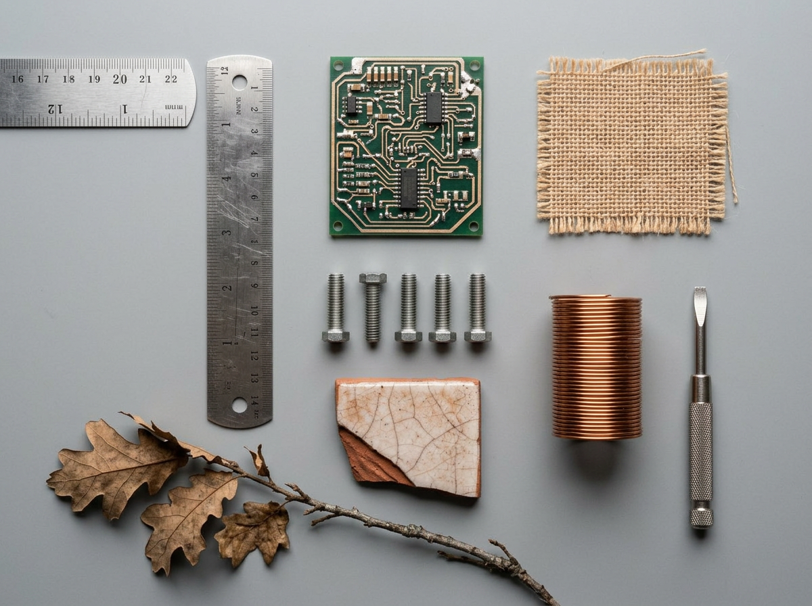</a>

<strong>M1.3 — Caso B</strong> Entrada desafiadora para distinguir textura, ruído e borda.

<a class="pdi_gallery_link" href="../images/input/ai_realistic/m2_1/m2_1_a_segmentacao.png">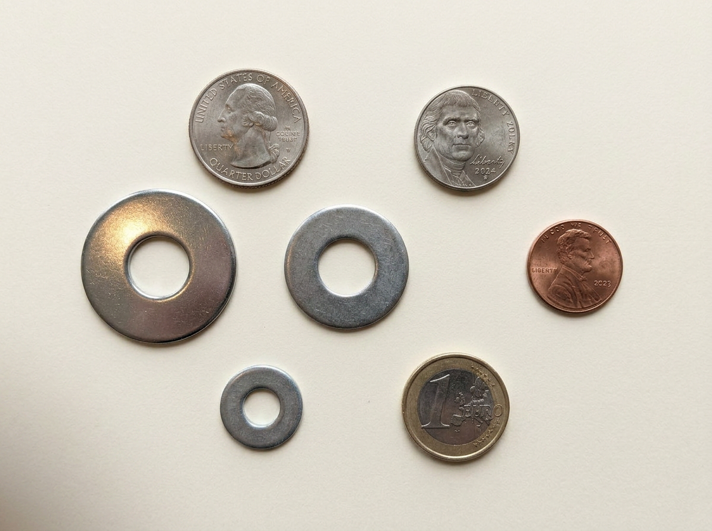</a>

<strong>M2.1 — Caso A</strong> Entrada favorável para limiarização e máscaras.

<a class="pdi_gallery_link" href="../images/input/ai_realistic/m2_1/m2_1_b_segmentacao.png">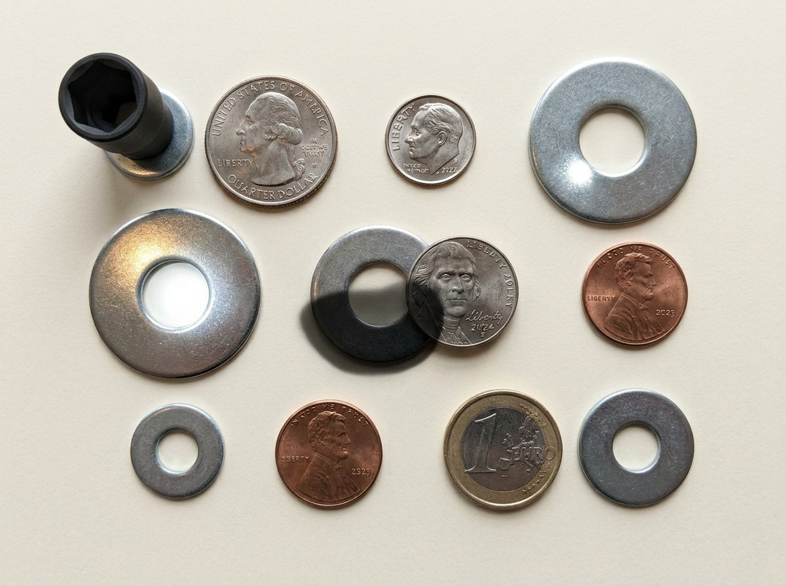</a>

<strong>M2.1 — Caso B</strong> Entrada desafiadora para segmentação global.

<a class="pdi_gallery_link" href="../images/input/ai_realistic/m2_2/m2_2_a_componentes_conexos.png">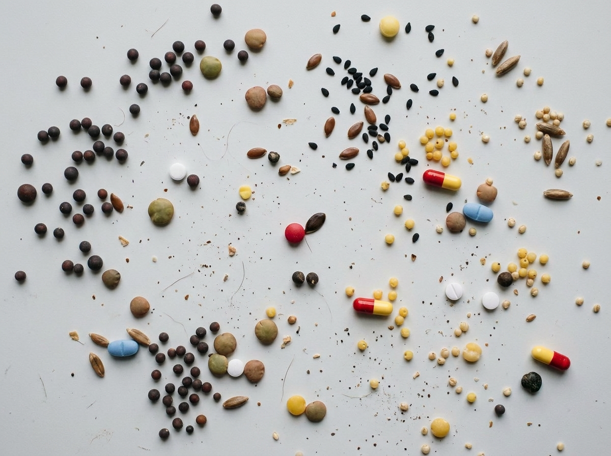</a>

<strong>M2.2 — Caso A</strong> Entrada favorável para rotulação e características geométricas.

<a class="pdi_gallery_link" href="../images/input/ai_realistic/m2_2/m2_2_b_componentes_conexos.png">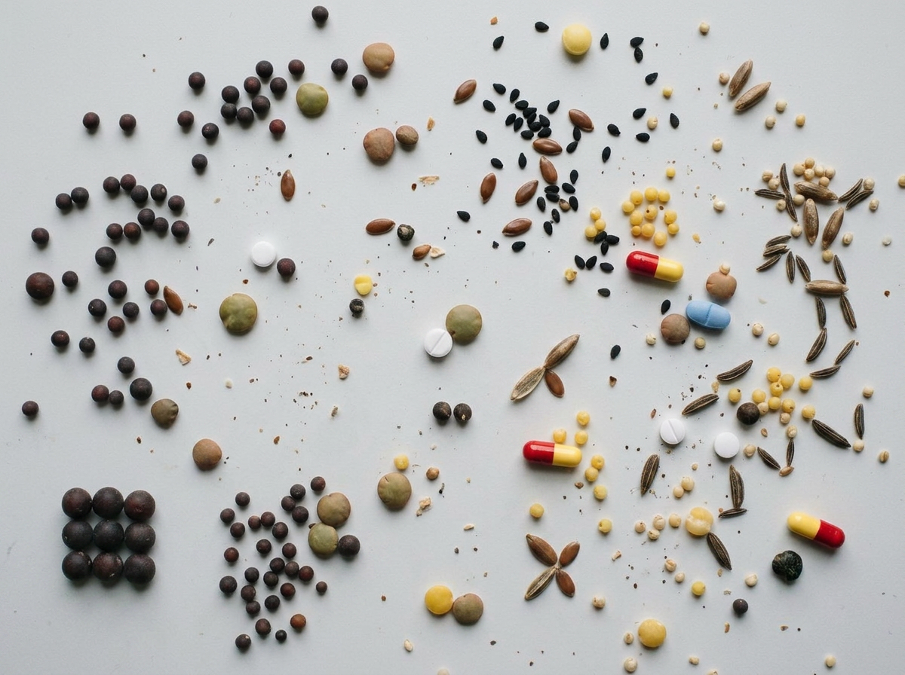</a>

<strong>M2.2 — Caso B</strong> Entrada desafiadora para separação de componentes.

<a class="pdi_gallery_link" href="../images/input/ai_realistic/m2_3/m2_3_a_morfologia.png">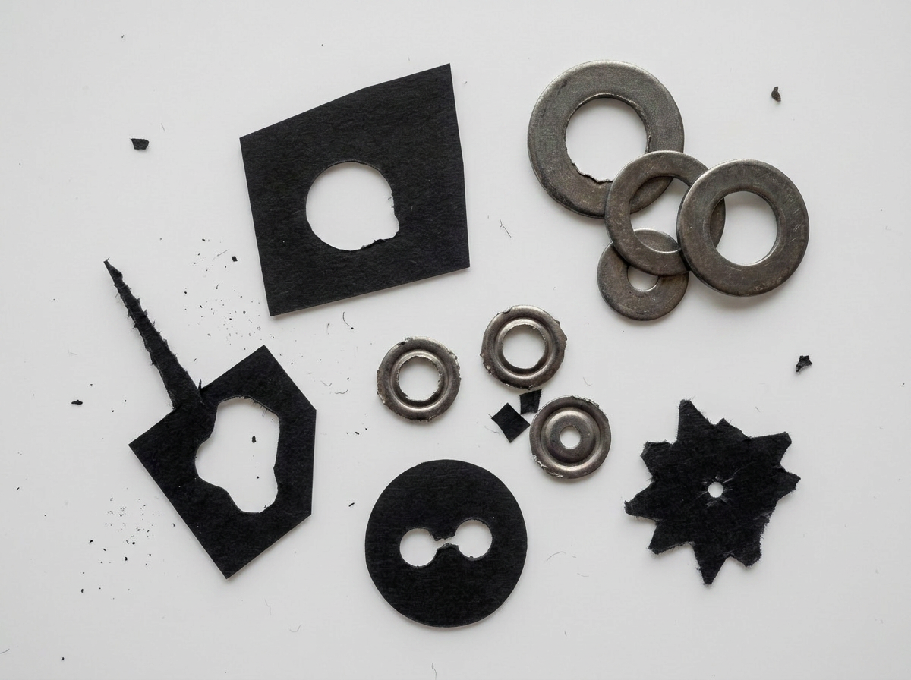</a>

<strong>M2.3 — Caso A</strong> Entrada favorável para limpeza e fechamento morfológico.

<a class="pdi_gallery_link" href="../images/input/ai_realistic/m2_3/m2_3_b_morfologia.png">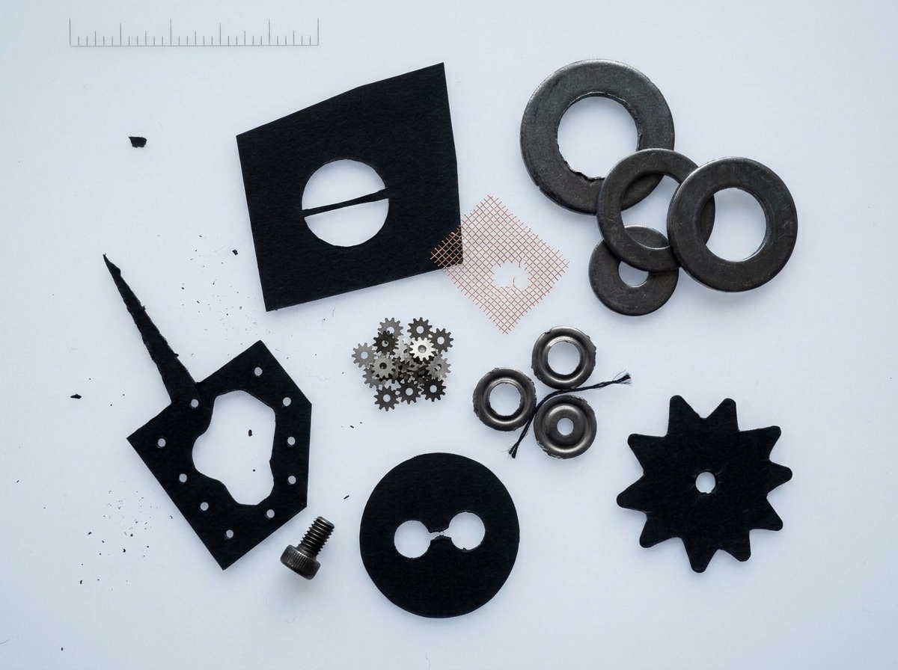</a>

<strong>M2.3 — Caso B</strong> Entrada desafiadora para justificar sequências morfológicas.

## Fotografias próprias (`images/input/own/`)

### `foto_borboleta_flor_01.jpg`

<a class="pdi_gallery_link" href="../images/input/own/foto_borboleta_flor_01.jpg">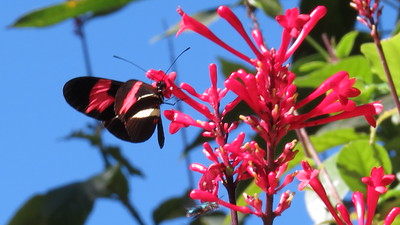</a>

- **Categoria**: fotografia própria.
- **Tipo editorial**: entrada.
- **Origem**: Marcelo Dornbusch Lopes.
- **Dimensões**: não informadas neste catálogo.
- **Laboratórios pertinentes**: M1.1, M1.3 e M2.1.
- **Finalidade**: demonstrar canais BGR, escala de cinza, quantização, bordas
  e segmentação por cor.
- **Observação**: caso favorável para exploração de contraste cromático.

### `foto_broto_planta_01.jpg`

<a class="pdi_gallery_link" href="../images/input/own/foto_broto_planta_01.jpg">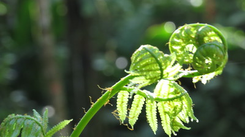</a>

- **Categoria**: fotografia própria.
- **Tipo editorial**: entrada.
- **Origem**: Marcelo Dornbusch Lopes.
- **Dimensões**: não informadas neste catálogo.
- **Laboratórios pertinentes**: M1.3 e M2.1.
- **Finalidade**: observar suavização, bordas e segmentação com baixo contraste
  entre tons de verde.
- **Observação**: caso desafiador para segmentação simples.

### `foto_cachorro_bola_01.jpg`

- **Categoria**: fotografia própria.
- **Tipo editorial**: entrada.
- **Origem**: Marcelo Dornbusch Lopes.
- **Dimensões**: não informadas neste catálogo.
- **Laboratórios pertinentes**: M1.1, M1.3 e M2.1.
- **Finalidade**: explorar contraste, detalhes em sombra e segmentação por cor
  da bola.
- **Observação**: caso misto, com região cromática favorável e fundo mais
  complexo.

### `foto_mosca_orquidea_01.jpg`

<a class="pdi_gallery_link" href="../images/input/own/foto_mosca_orquidea_01.jpg">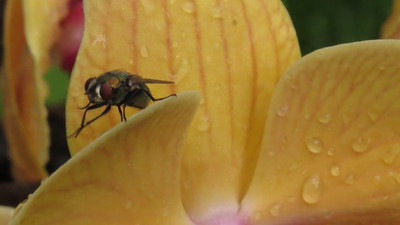</a>

- **Categoria**: fotografia própria.
- **Tipo editorial**: entrada.
- **Origem**: Marcelo Dornbusch Lopes.
- **Dimensões**: não informadas neste catálogo.
- **Laboratórios pertinentes**: M1.3 e M2.1.
- **Finalidade**: discutir pequenos objetos, textura, bordas e limitações de
  segmentação simples.
- **Observação**: caso desafiador.

### `foto_passaro_comedouro_01.png`

<a class="pdi_gallery_link" href="../images/input/own/foto_passaro_comedouro_01.png">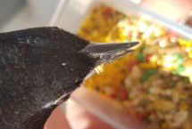</a>

- **Categoria**: fotografia própria.
- **Tipo editorial**: entrada.
- **Origem**: Marcelo Dornbusch Lopes.
- **Dimensões**: não informadas neste catálogo.
- **Laboratórios pertinentes**: M1.1 e M1.3.
- **Finalidade**: comparar versão colorida e versão originalmente em preto e
  branco, além de explorar quantização e realce.
- **Observação**: caso visualmente rico.

### `foto_passaro_comedouro_pb_01.png`

<a class="pdi_gallery_link" href="../images/input/own/foto_passaro_comedouro_pb_01.png">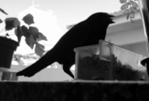</a>

- **Categoria**: fotografia própria.
- **Tipo editorial**: entrada.
- **Origem**: Marcelo Dornbusch Lopes.
- **Dimensões**: não informadas neste catálogo.
- **Laboratórios pertinentes**: M1.1, M1.3 e M2.1.
- **Finalidade**: avaliar operações de intensidade em material originalmente em
  preto e branco.
- **Observação**: não é resultado derivado; trata-se de fotografia própria
  originalmente em preto e branco.

### `foto_passaro_fibra_01.jpg`

<a class="pdi_gallery_link" href="../images/input/own/foto_passaro_fibra_01.jpg">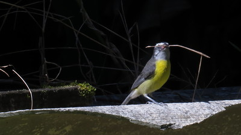</a>

- **Categoria**: fotografia própria.
- **Tipo editorial**: entrada.
- **Origem**: Marcelo Dornbusch Lopes.
- **Dimensões**: não informadas neste catálogo.
- **Laboratórios pertinentes**: M1.3, M2.1 e M2.2.
- **Finalidade**: explorar bordas finas, texturas e segmentação de objeto com
  forma orgânica.
- **Observação**: caso desafiador.

### `foto_pimenteira_frutos_01.png`

<a class="pdi_gallery_link" href="../images/input/own/foto_pimenteira_frutos_01.png">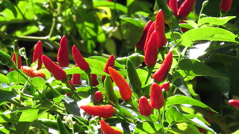</a>

- **Categoria**: fotografia própria.
- **Tipo editorial**: entrada.
- **Origem**: Marcelo Dornbusch Lopes.
- **Dimensões**: não informadas neste catálogo.
- **Laboratórios pertinentes**: M1.1, M2.1 e M2.2.
- **Finalidade**: segmentar frutos vermelhos, estudar componentes conexos e
  discutir máscaras por cor.
- **Observação**: caso favorável para segmentação cromática.

## Imagens de terceiro (`images/input/third_party/opencv/`)

### `opencv_adaptive_threshold_sudoku.jpg`

<a class="pdi_gallery_link" href="../images/input/third_party/opencv/opencv_adaptive_threshold_sudoku.jpg">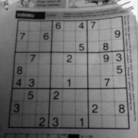</a>

- **Categoria**: imagem de terceiro.
- **Tipo editorial**: entrada.
- **Origem**: documentação oficial do OpenCV.
- **Dimensões**: não informadas neste catálogo.
- **Laboratórios pertinentes**: M2.1.
- **Finalidade**: demonstrar limiarização global, Otsu e limiarização
  adaptativa.
- **Observação**: caso clássico para comparação entre estratégias de
  binarização.

### `opencv_morphology_j_binary.png`

- **Categoria**: imagem de terceiro.
- **Tipo editorial**: entrada.
- **Origem**: documentação oficial do OpenCV.
- **Dimensões**: não informadas neste catálogo.
- **Laboratórios pertinentes**: M2.3.
- **Finalidade**: demonstrar erosão, dilatação, abertura e fechamento em caso
  binário controlado.
- **Observação**: caso favorável para morfologia matemática.

## Imagens realistas geradas por IA (`images/input/ai_realistic/`)

As imagens abaixo foram organizadas em pares **A** e **B** por laboratório. Em
geral, o caso **A** é mais favorável e o caso **B** é mais desafiador. Todas as
imagens deste conjunto possuem dimensão `1200 × 896` pixels.

### M1.1 — RGB, escala de cinza e quantização

#### `m1_1_a_rgb_quantizacao.png`

- **Categoria**: imagem realista gerada por IA.
- **Tipo editorial**: entrada.
- **Origem**: Genspark.
- **Dimensões**: `1200 × 896`.
- **Laboratório pertinente**: M1.1.
- **Finalidade**: canais, escala de cinza e quantização.
- **Caso**: A — favorável.

#### `m1_1_b_rgb_quantizacao.png`

- **Categoria**: imagem realista gerada por IA.
- **Tipo editorial**: entrada.
- **Origem**: Genspark.
- **Dimensões**: `1200 × 896`.
- **Laboratório pertinente**: M1.1.
- **Finalidade**: quantização e perda de detalhe em cena mais complexa.
- **Caso**: B — desafiadora.

### M1.2 — Projeto aplicado preliminar

#### `m1_2_a_dominio_valor.png`

- **Categoria**: imagem realista gerada por IA.
- **Tipo editorial**: entrada.
- **Origem**: Genspark.
- **Dimensões**: `1200 × 896`.
- **Laboratório pertinente**: M1.2.
- **Finalidade**: estudo de caso preliminar no domínio do valor.
- **Caso**: A — favorável.

#### `m1_2_b_dominio_valor.png`

- **Categoria**: imagem realista gerada por IA.
- **Tipo editorial**: entrada.
- **Origem**: Genspark.
- **Dimensões**: `1200 × 896`.
- **Laboratório pertinente**: M1.2.
- **Finalidade**: estudo de caso com maior complexidade tonal.
- **Caso**: B — desafiadora.

### M1.3 — Convolução e filtragem espacial

#### `m1_3_a_espacial_bordas.png`

- **Categoria**: imagem realista gerada por IA.
- **Tipo editorial**: entrada.
- **Origem**: Genspark.
- **Dimensões**: `1200 × 896`.
- **Laboratório pertinente**: M1.3.
- **Finalidade**: suavização, realce e detecção de bordas em caso controlado.
- **Caso**: A — favorável.

#### `m1_3_b_espacial_bordas.png`

- **Categoria**: imagem realista gerada por IA.
- **Tipo editorial**: entrada.
- **Origem**: Genspark.
- **Dimensões**: `1200 × 896`.
- **Laboratório pertinente**: M1.3.
- **Finalidade**: bordas e suavização em cena mais texturizada.
- **Caso**: B — desafiadora.

### M2.1 — Segmentação

#### `m2_1_a_segmentacao.png`

- **Categoria**: imagem realista gerada por IA.
- **Tipo editorial**: entrada.
- **Origem**: Genspark.
- **Dimensões**: `1200 × 896`.
- **Laboratório pertinente**: M2.1.
- **Finalidade**: limiarização e máscaras em caso relativamente favorável.
- **Caso**: A — favorável.

#### `m2_1_b_segmentacao.png`

- **Categoria**: imagem realista gerada por IA.
- **Tipo editorial**: entrada.
- **Origem**: Genspark.
- **Dimensões**: `1200 × 896`.
- **Laboratório pertinente**: M2.1.
- **Finalidade**: segmentação com sombras, reflexos e objetos próximos.
- **Caso**: B — desafiadora.

### M2.2 — Componentes conexos

#### `m2_2_a_componentes_conexos.png`

- **Categoria**: imagem realista gerada por IA.
- **Tipo editorial**: entrada.
- **Origem**: Genspark.
- **Dimensões**: `1200 × 896`.
- **Laboratório pertinente**: M2.2.
- **Finalidade**: rotulação e extração de características após segmentação.
- **Caso**: A — favorável.

#### `m2_2_b_componentes_conexos.png`

- **Categoria**: imagem realista gerada por IA.
- **Tipo editorial**: entrada.
- **Origem**: Genspark.
- **Dimensões**: `1200 × 896`.
- **Laboratório pertinente**: M2.2.
- **Finalidade**: conectividade e separação de componentes em cena ambígua.
- **Caso**: B — desafiadora.

### M2.3 — Morfologia matemática

#### `m2_3_a_morfologia.png`

- **Categoria**: imagem realista gerada por IA.
- **Tipo editorial**: entrada.
- **Origem**: Genspark.
- **Dimensões**: `1200 × 896`.
- **Laboratório pertinente**: M2.3.
- **Finalidade**: geração de máscaras, limpeza morfológica e comparação entre
  operações.
- **Caso**: A — favorável.

#### `m2_3_b_morfologia.png`

- **Categoria**: imagem realista gerada por IA.
- **Tipo editorial**: entrada.
- **Origem**: Genspark.
- **Dimensões**: `1200 × 896`.
- **Laboratório pertinente**: M2.3.
- **Finalidade**: demonstrar ruído, pequenos buracos e justificativa de
  sequências morfológicas.
- **Caso**: B — desafiadora.

## Imagens sintéticas computacionais oficiais

O diretório `images/synthetic/` permanece reservado para imagens geradas por
código e destinadas a testes controlados. Nesta rodada, não foram adicionadas
novas imagens sintéticas oficiais ao catálogo público.

## Resultados curados

O diretório `docs/images/results/` contém uma seleção manual das saídas reais
geradas pelos executáveis integrados dos seis laboratórios. A curadoria evita
copiar integralmente `images/output/` e mantém apenas entradas sintéticas
indispensáveis, intermediários explicativos e saídas representativas.

As galerias e os comandos correspondentes estão nas páginas:

- [Laboratório M1.1](labs/m1-1.md)
- [Laboratório M1.2](labs/m1-2.md)
- [Laboratório M1.3](labs/m1-3.md)
- [Laboratório M2.1](labs/m2-1.md)
- [Laboratório M2.2](labs/m2-2.md)
- [Laboratório M2.3](labs/m2-3.md)

O conjunto curado adiciona aproximadamente **7,8 MiB** distribuídos em 37
arquivos. As imagens mantêm a resolução produzida pelos laboratórios; não foram
criadas duplicatas redimensionadas nem foi adotado Git LFS.
