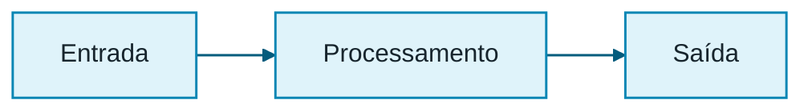

# Diretrizes de imagens

Este documento define a política pública de imagens do `pdi-labs` para uso no
repositório, na documentação Doxygen e em publicações derivadas do projeto.

## Categorias editoriais

As imagens do projeto devem ser classificadas em uma das categorias abaixo.

1. **Imagem sintética computacional**: produzida por código para testes
   controlados e validações exatas.
2. **Fotografia própria**: capturada pelo responsável pelo projeto.
3. **Imagem realista gerada por IA**: produzida por ferramenta de IA com
   aparência fotográfica.
4. **Imagem de terceiro**: redistribuída ou referenciada a partir de outra
   fonte pública autorizada.
5. **Imagem derivada ou resultado curado**: saída produzida pelos algoritmos do
   projeto e selecionada manualmente para documentação.

> **Importante:** imagens realistas geradas por IA não são fotografias.

> **Importante:** fotografias originalmente em preto e branco continuam sendo
> classificadas como fotografias próprias, e não como resultados derivados.

## Estrutura de diretórios

As imagens devem ser organizadas por origem.

```text
images/
├── input/
│   ├── own/
│   ├── ai_realistic/
│   └── third_party/
├── synthetic/
└── output/

docs/
└── images/
    └── results/
```

### Regras principais

- `images/input/` contém entradas oficiais.
- `images/synthetic/` contém ou conterá imagens sintéticas computacionais.
- `images/output/` **não** é versionado e deve ser usado apenas para saídas
  locais.
- `docs/images/results/` contém somente resultados curados, isto é, saídas
  escolhidas manualmente para a documentação.

## Geração e curadoria de resultados

Nesta fase do projeto, os resultados de processamento serão:

1. gerados localmente;
2. revisados manualmente;
3. selecionados com critério didático;
4. versionados apenas quando forem resultados curados.

A automação completa dessa geração e curadoria fica adiada para incremento
posterior.

## Convenções de nomenclatura

Todos os nomes de arquivos devem seguir:

- minúsculas;
- `snake_case`;
- sem acentos;
- extensão em minúsculas;
- nomes descritivos;
- sem termos genéricos como `sample`, `example`, `test` ou `image`.

Convenções específicas:

- fotografias próprias devem usar o prefixo `foto_`;
- arquivos do OpenCV devem usar o prefixo `opencv_`;
- imagens realistas geradas por IA podem ser organizadas por laboratório e caso
  (`a` e `b`).

## URLs privadas, ZIPs e duplicação de arquivos

Não devem ser publicados no repositório:

- URLs privadas de contas, sessões ou plataformas de geração;
- arquivos ZIP usados apenas como meio de transporte;
- diretórios com originais duplicados sem necessidade técnica;
- cópias redundantes criadas apenas para web, quando a imagem original já é
  adequada.

Quando houver endereços privados fornecidos por plataformas externas, eles
deve ser removidos da documentação pública.

## Texto alternativo e legendas

Toda imagem exibida em documentação deve possuir:

- **texto alternativo** (`alt`) sucinto e descritivo;
- **legenda** ou contexto textual indicando finalidade didática;
- indicação da categoria editorial quando isso for relevante para a leitura.

Boas práticas:

- descrever o conteúdo visual principal;
- indicar o laboratório ou operação ilustrada;
- evitar textos genéricos como “imagem” ou “figura 1” no `alt`.

## Resolução e tamanho dos arquivos

A redução de resolução deve ser adotada apenas quando um arquivo estiver
excessivamente grande para uso didático ou para versionamento confortável.

Política atual:

- não criar, por padrão, uma cópia “web” adicional de cada imagem;
- manter um único arquivo quando sua resolução já for adequada;
- reduzir resolução somente quando necessário;
- registrar a decisão no histórico do projeto, quando relevante.

## Relação com Doxygen e GitHub Pages

As páginas Markdown de documentação podem usar miniaturas clicáveis, sem
JavaScript e sem conteúdo em base64. Os arquivos devem ser acessíveis por links
relativos válidos e compatíveis com a renderização do GitHub e com a geração da
documentação HTML.
## Como repetir o padrão de galeria

Uma página de laboratório deve usar uma grade contendo um ou mais cartões. Cada
cartão deve possuir um link para o arquivo original, uma miniatura com texto
alternativo e uma legenda interpretativa.

```html
<div class="pdi_gallery_grid">
<div class="pdi_gallery_card">
<a class="pdi_gallery_link" href="../../images/input/ai_realistic/m1_1/m1_1_a_rgb_quantizacao.png">

</a>
<div class="pdi_gallery_caption"><strong>Caso A.</strong> Entrada favorável para o objetivo descrito.</div>
</div>
</div>
```

Regras para reutilização:

- ajustar o caminho relativo conforme a localização do Markdown;
- manter `pdi_gallery_grid`, `pdi_gallery_card` e `pdi_gallery_image`;
- escrever um `alt` específico;
- usar a legenda para explicar finalidade e dificuldade;
- não definir largura e altura diretamente no HTML;
- não criar cópia adicional da imagem apenas para a miniatura.
## Caminhos na documentação HTML

A galeria pública prioriza a saída HTML do Doxygen e sua futura publicação no
GitHub Pages. O Doxygen achata as páginas Markdown em `docs/html/` e copia as
imagens de entrada para `docs/images/input/`. Por isso, páginas de laboratório
devem usar caminhos iniciados por `../images/input/` no HTML da galeria.

A classe visual deve ser aplicada ao link, e não diretamente à tag `img`:

```html
<div class="pdi_gallery_card">
<a class="pdi_gallery_link" href="../images/input/caminho/arquivo.png">

</a>
<div class="pdi_gallery_caption">Legenda contextual.</div>
</div>
```

Essa estrutura evita conflito com classes adicionadas automaticamente pelo
Doxygen às imagens e mantém o clique para abrir o arquivo original.

## Paleta para diagramas Mermaid

Os diagramas Mermaid devem registrar a identidade visual no próprio bloco.
Use o tema `base`, as variáveis institucionais e estilos explícitos para nós e
arestas. Isso permite que renderizadores compatíveis, como o GitHub e uma
futura etapa com Mermaid CLI, apliquem a mesma paleta.



O Doxygen ainda apresenta blocos Mermaid como código nesta etapa. A paleta fica
registrada para quem os renderizar; a conversão automática para SVG será
tratada em incremento posterior.

## Curadoria de resultados processados

Resultados documentais devem ser escolhidos manualmente a partir de execuções
reais. Não se copia integralmente `images/output/`, não se publica YAML volumoso
e não se cria uma segunda versão do mesmo original apenas para formar a
galeria. Cada página registra comando, parâmetros, origem da entrada, métricas
curtas e limitações observadas.

Os resultados versionados ficam em `docs/images/results/<laboratório>/`. Durante
a geração Doxygen, o alvo `docs` copia essa árvore para
`build/<configuração>/docs/images/results/`, permitindo o uso de links
`../images/results/...` nas páginas HTML achatadas.
