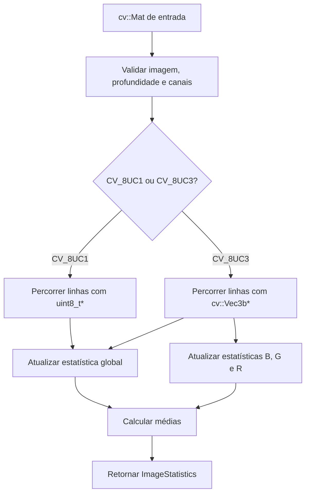
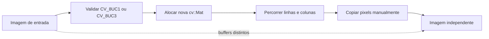
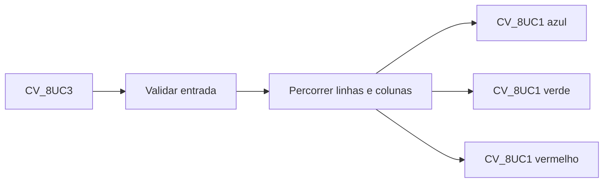
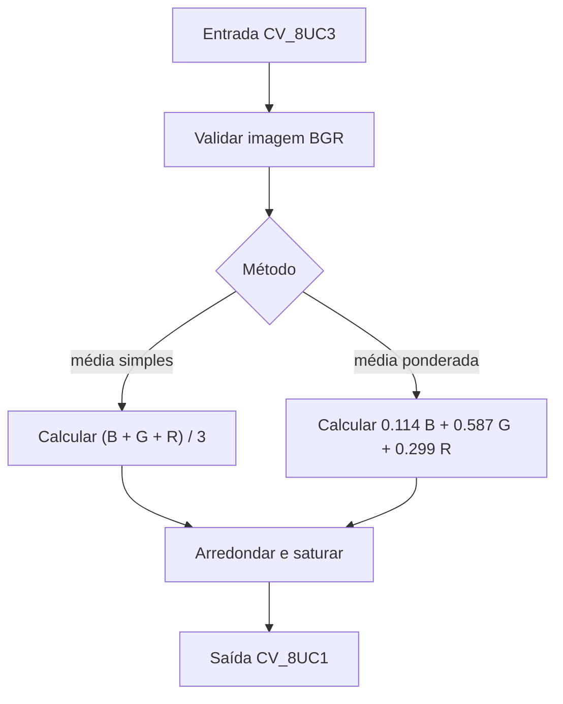

# Laboratório M1.1 — Representação e acesso a pixels

## 1. Escopo deste incremento

O primeiro componente do Laboratório M1.1 é a inspeção manual de imagens. A
classe `pdi::value::ImageInspector` calcula metadados estruturais e estatísticas
de intensidade sem usar funções prontas de estatística do OpenCV.

Este incremento suporta:

- imagens em níveis de cinza `CV_8UC1`;
- imagens coloridas BGR `CV_8UC3`;
- largura e altura;
- quantidade de pixels;
- quantidade de canais;
- tipo numérico do OpenCV;
- mínimo, máximo, soma e média globais;
- mínimo, máximo, soma e média dos canais B, G e R.

## 2. Interpretação das estatísticas globais

Para uma imagem `CV_8UC1`, cada pixel fornece uma amostra de intensidade.

Para uma imagem `CV_8UC3`, cada pixel fornece três amostras escalares. Assim, a
estatística global colorida considera todos os valores B, G e R. Além dela, o
resultado contém estatísticas independentes para cada canal.

A soma é mantida em `std::uint64_t`. Isso evita o overflow que ocorreria se
muitos pixels fossem acumulados em `uchar` ou em um inteiro pequeno.

## 3. Ordem BGR

O OpenCV armazena pixels coloridos convencionais na ordem:

| Índice | Canal |
|---:|---|
| `0` | azul |
| `1` | verde |
| `2` | vermelho |

O percurso usa um ponteiro `cv::Vec3b*` por linha. Os três canais são acessados
diretamente. Não existe um terceiro laço para percorrer canais.

```cpp
const auto* row_ptr = image.ptr<cv::Vec3b>(row);
const cv::Vec3b pixel = row_ptr[col];

const std::uint8_t blue = pixel[0];
const std::uint8_t green = pixel[1];
const std::uint8_t red = pixel[2];
```

## 4. Fluxo do componente



## 5. Pseudocódigo

```text
função inspecionar(imagem):
    validar imagem não vazia
    validar profundidade CV_8U
    validar que canais é 1 ou 3

    resultado.largura <- imagem.colunas
    resultado.altura <- imagem.linhas
    resultado.pixels <- linhas * colunas
    resultado.tipo <- imagem.tipo

    se imagem possui 1 canal:
        para cada linha:
            obter ponteiro uint8_t para a linha
            para cada coluna:
                valor <- linha[coluna]
                atualizar mínimo, máximo, soma e quantidade global

    senão:
        para cada linha:
            obter ponteiro cv::Vec3b para a linha
            para cada coluna:
                pixel <- linha[coluna]
                azul <- pixel[0]
                verde <- pixel[1]
                vermelho <- pixel[2]

                atualizar estatística global com azul, verde e vermelho
                atualizar estatística azul
                atualizar estatística verde
                atualizar estatística vermelha

    calcular as médias usando soma / quantidade de amostras
    retornar resultado
```

## 6. Restrições preservadas

A implementação não utiliza:

```cpp
cv::minMaxLoc();
cv::mean();
cv::calcHist();
cv::Mat::at();
```

Também não usa conversão de cor, separação de canais ou qualquer filtro pronto.

## 7. Complexidade

Para uma imagem com `M` linhas e `N` colunas, o percurso visita cada pixel uma
vez:

```text
O(MN)
```

O trabalho executado por pixel é constante. Em uma imagem BGR, são tratados
três valores explicitamente, sem alterar a ordem assintótica.

A memória adicional utilizada pelos acumuladores e registros é constante:

```text
O(1)
```

## 8. Validação por testes

Os testes usam imagens sintéticas pequenas com valores conhecidos:

- imagem `2 × 3` em níveis de cinza;
- imagem `2 × 2` colorida em BGR;
- imagem vazia;
- profundidade incompatível;
- quantidade de canais incompatível.

As médias esperadas são calculadas de forma independente e verificadas com
`Catch::Approx`.


## 9. Cópia manual de imagens

A classe `pdi::value::ImageCopy` cria uma nova matriz com as mesmas dimensões e
o mesmo tipo da entrada e copia cada pixel explicitamente.

A implementação não usa:

```cpp
input_image.clone();
input_image.copyTo(output_image);
cv::Mat output_image = input_image;
```

A última forma seria apenas uma atribuição rasa: as duas matrizes apontariam
para o mesmo armazenamento de pixels. A cópia manual deve produzir buffers
independentes.

### 9.1 Percurso em níveis de cinza

```cpp
for (int row = 0; row < input_image.rows; ++row) {
    const auto* input_row = input_image.ptr<std::uint8_t>(row);
    auto* output_row = output_image.ptr<std::uint8_t>(row);

    for (int col = 0; col < input_image.cols; ++col) {
        output_row[col] = input_row[col];
    }
}
```

### 9.2 Percurso BGR

```cpp
for (int row = 0; row < input_image.rows; ++row) {
    const auto* input_row = input_image.ptr<cv::Vec3b>(row);
    auto* output_row = output_image.ptr<cv::Vec3b>(row);

    for (int col = 0; col < input_image.cols; ++col) {
        output_row[col] = input_row[col];
    }
}
```

O `cv::Vec3b` copia simultaneamente os valores B, G e R de um pixel, sem um
laço adicional de canais.

### 9.3 Independência da cópia

Depois da operação:

```text
entrada.data ≠ saída.data
```

Alterar um pixel da saída não pode modificar a entrada. Da mesma forma, uma
alteração posterior na entrada não pode modificar a saída.



### 9.4 Pseudocódigo

```text
função copiar(imagem):
    validar imagem não vazia
    validar profundidade CV_8U
    validar que canais é 1 ou 3

    saída <- nova matriz com mesmas linhas, colunas e tipo

    se imagem possui 1 canal:
        para cada linha:
            obter ponteiro de entrada uint8_t
            obter ponteiro de saída uint8_t
            para cada coluna:
                saída[coluna] <- entrada[coluna]

    senão:
        para cada linha:
            obter ponteiro de entrada cv::Vec3b
            obter ponteiro de saída cv::Vec3b
            para cada coluna:
                saída[coluna] <- entrada[coluna]

    retornar saída
```

A complexidade temporal é `O(MN)` e a nova imagem exige `O(MN)` de memória,
pois uma cópia profunda precisa armazenar todos os pixels em um buffer próprio.


## 10. Separação manual dos canais B, G e R

A classe `pdi::value::ChannelSeparator` recebe uma imagem `CV_8UC3` e retorna
um `ChannelSet` com três matrizes `CV_8UC1`.

```cpp
struct ChannelSet {
    cv::Mat blue;
    cv::Mat green;
    cv::Mat red;
};
```

A ordem de armazenamento do OpenCV é BGR:

```text
pixel[0] = azul
pixel[1] = verde
pixel[2] = vermelho
```

O algoritmo usa um ponteiro de entrada `cv::Vec3b*` e três ponteiros de saída
`std::uint8_t*` por linha. Não há laço adicional de canais e `cv::split()` não
é utilizado.



### 10.1 Pseudocódigo

```text
função separar_canais(imagem):
    validar imagem não vazia
    validar profundidade CV_8U
    validar exatamente 3 canais

    criar saída azul CV_8UC1
    criar saída verde CV_8UC1
    criar saída vermelha CV_8UC1

    para cada linha:
        obter ponteiro cv::Vec3b da entrada
        obter ponteiro uint8_t de cada saída

        para cada coluna:
            pixel <- entrada[coluna]
            azul[coluna] <- pixel[0]
            verde[coluna] <- pixel[1]
            vermelho[coluna] <- pixel[2]

    retornar ChannelSet
```

### 10.2 Exemplo executável

```bash
./build/ucrt64-debug/lab_m1_1_channels.exe \
    images/input/sample.png \
    images/output/m1_1_channels
```

Arquivos gerados:

```text
channel_blue.png
channel_green.png
channel_red.png
```

Os nomes identificam explicitamente cada canal e evitam ambiguidade entre a
ordem RGB conceitual e a ordem BGR usada pelo OpenCV.


## 11. Conversão manual para níveis de cinza

A classe `pdi::value::GrayscaleConverter` oferece duas conversões manuais para
uma entrada `CV_8UC3`. As duas produzem uma imagem `CV_8UC1`.

### 11.1 Média simples

Cada canal contribui com o mesmo peso:

```text
cinza = (B + G + R) / 3
```

Esse método é simples, mas não representa a sensibilidade desigual da percepção
humana às diferentes componentes de cor.

### 11.2 Média ponderada

A conversão ponderada usa:

```text
cinza = 0.299 R + 0.587 G + 0.114 B
```

Embora a fórmula seja usualmente escrita em ordem RGB, o acesso ao pixel no
OpenCV permanece em ordem BGR:

```text
pixel[0] = B
pixel[1] = G
pixel[2] = R
```

O verde recebe o maior peso, o vermelho recebe um peso intermediário e o azul
recebe o menor peso.

### 11.3 Arredondamento e controle de intervalo

Os cálculos são realizados em `double`. O resultado é encaminhado a
`pdi::core::saturate_to_byte`, que limita o valor ao intervalo `[0, 255]`,
arredonda com `std::lround` e retorna `std::uint8_t`.

```text
20.33 -> 20
20.67 -> 21
```

### 11.4 Fluxo



### 11.5 Pseudocódigo

```text
função converter_para_cinza(imagem, método):
    validar imagem não vazia
    validar profundidade CV_8U
    validar exatamente 3 canais

    criar saída CV_8UC1

    para cada linha:
        obter ponteiro cv::Vec3b da entrada
        obter ponteiro uint8_t da saída

        para cada coluna:
            B <- pixel[0]
            G <- pixel[1]
            R <- pixel[2]

            se método é média:
                valor <- (B + G + R) / 3
            senão:
                valor <- 0.114 B + 0.587 G + 0.299 R

            saída[coluna] <- arredondar_e_saturar(valor)

    retornar saída
```

### 11.6 Exemplo executável

```bash
./build/ucrt64-debug/lab_m1_1_grayscale.exe \
    images/input/sample.png \
    images/output/m1_1_grayscale
```

Arquivos produzidos:

```text
grayscale_average.png
grayscale_weighted.png
```

A média simples trata os canais igualmente. A média ponderada aproxima melhor a
luminância percebida.


## 12. Persistência e exibição opcional

Os executáveis do Laboratório M1.1 reutilizam `pdi::io::ImageFileStorage` para
carregar a entrada e salvar resultados. Isso elimina funções locais repetidas
de persistência.

Sem `--show`, os programas funcionam em modo headless:

```bash
./build/ucrt64-debug/lab_m1_1_channels.exe \
    images/input/sample.png \
    images/output/m1_1_channels
```

Com `--show`, a entrada e todos os resultados também são apresentados em
janelas com títulos inequívocos:

```bash
./build/ucrt64-debug/lab_m1_1_grayscale.exe \
    images/input/sample.png \
    images/output/m1_1_grayscale \
    --show
```

A exibição usa explicitamente `cv::namedWindow` e `cv::imshow`. Depois que todas
as janelas são criadas, uma única chamada de `cv::waitKey` aguarda uma tecla e
`cv::destroyAllWindows` encerra a sessão.

A opção gráfica é complementar. Testes automatizados e ambientes de integração
contínua devem executar os programas sem `--show`.

### Política dos diretórios de imagens

```text
images/synthetic/  imagens sintéticas reproduzíveis e versionadas
images/input/      entradas oficiais selecionadas e versionadas seletivamente
images/output/     artefatos gerados localmente e não versionados
```
