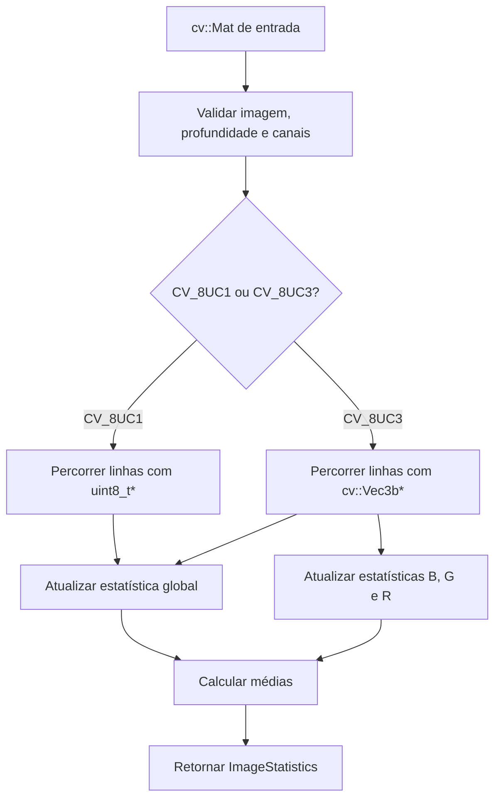

# Laboratório M1.1 — Representação e acesso a pixels

## 1. Escopo deste incremento

O primeiro componente do Laboratório M1.1 é a inspeção manual de imagens. A
classe `pdi::value::ImageInspector` calcula metadados estruturais e estatísticas
de intensidade sem usar funções prontas de estatística do OpenCV.

Este incremento suporta:

- imagens em níveis de cinza `CV_8UC1`;
- imagens coloridas BGR `CV_8UC3`;
- largura e altura;
- quantidade de pixels;
- quantidade de canais;
- tipo numérico do OpenCV;
- mínimo, máximo, soma e média globais;
- mínimo, máximo, soma e média dos canais B, G e R.

## 2. Interpretação das estatísticas globais

Para uma imagem `CV_8UC1`, cada pixel fornece uma amostra de intensidade.

Para uma imagem `CV_8UC3`, cada pixel fornece três amostras escalares. Assim, a
estatística global colorida considera todos os valores B, G e R. Além dela, o
resultado contém estatísticas independentes para cada canal.

A soma é mantida em `std::uint64_t`. Isso evita o overflow que ocorreria se
muitos pixels fossem acumulados em `uchar` ou em um inteiro pequeno.

## 3. Ordem BGR

O OpenCV armazena pixels coloridos convencionais na ordem:

| Índice | Canal |
|---:|---|
| `0` | azul |
| `1` | verde |
| `2` | vermelho |

O percurso usa um ponteiro `cv::Vec3b*` por linha. Os três canais são acessados
diretamente. Não existe um terceiro laço para percorrer canais.

```cpp
const auto* row_ptr = image.ptr<cv::Vec3b>(row);
const cv::Vec3b pixel = row_ptr[col];

const std::uint8_t blue = pixel[0];
const std::uint8_t green = pixel[1];
const std::uint8_t red = pixel[2];
```

## 4. Fluxo do componente



## 5. Pseudocódigo

```text
função inspecionar(imagem):
    validar imagem não vazia
    validar profundidade CV_8U
    validar que canais é 1 ou 3

    resultado.largura <- imagem.colunas
    resultado.altura <- imagem.linhas
    resultado.pixels <- linhas * colunas
    resultado.tipo <- imagem.tipo

    se imagem possui 1 canal:
        para cada linha:
            obter ponteiro uint8_t para a linha
            para cada coluna:
                valor <- linha[coluna]
                atualizar mínimo, máximo, soma e quantidade global

    senão:
        para cada linha:
            obter ponteiro cv::Vec3b para a linha
            para cada coluna:
                pixel <- linha[coluna]
                azul <- pixel[0]
                verde <- pixel[1]
                vermelho <- pixel[2]

                atualizar estatística global com azul, verde e vermelho
                atualizar estatística azul
                atualizar estatística verde
                atualizar estatística vermelha

    calcular as médias usando soma / quantidade de amostras
    retornar resultado
```

## 6. Restrições preservadas

A implementação não utiliza:

```cpp
cv::minMaxLoc();
cv::mean();
cv::calcHist();
cv::Mat::at();
```

Também não usa conversão de cor, separação de canais ou qualquer filtro pronto.

## 7. Complexidade

Para uma imagem com `M` linhas e `N` colunas, o percurso visita cada pixel uma
vez:

```text
O(MN)
```

O trabalho executado por pixel é constante. Em uma imagem BGR, são tratados
três valores explicitamente, sem alterar a ordem assintótica.

A memória adicional utilizada pelos acumuladores e registros é constante:

```text
O(1)
```

## 8. Validação por testes

Os testes usam imagens sintéticas pequenas com valores conhecidos:

- imagem `2 × 3` em níveis de cinza;
- imagem `2 × 2` colorida em BGR;
- imagem vazia;
- profundidade incompatível;
- quantidade de canais incompatível.

As médias esperadas são calculadas de forma independente e verificadas com
`Catch::Approx`.
