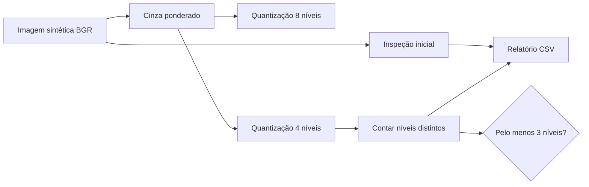
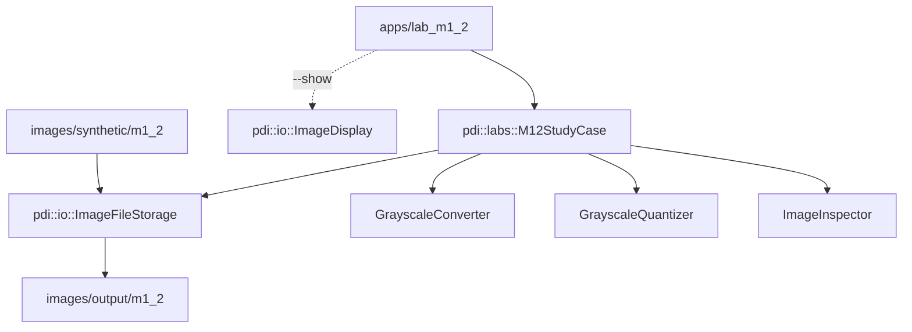

# Laboratório M1.2 — Proposta preliminar de projeto aplicado

## 1. Natureza deste laboratório

Este laboratório apresenta um **estudo de viabilidade preliminar**. Ele não
constitui um sistema completo e não pretende substituir segmentação,
classificação ou avaliação experimental mais ampla.

A proposta usa apenas técnicas já implementadas na M1:

- inspeção de imagem;
- conversão ponderada para níveis de cinza;
- quantização uniforme;
- persistência e inspeção visual dos resultados.

## 2. Problema

O problema escolhido é verificar se uma cena controlada pode ter suas zonas de
iluminação simplificadas sem perder a distinção entre áreas escuras,
intermediárias e claras.

Uma aplicação futura poderia usar essa simplificação como etapa preliminar de:

- inspeção de iluminação de ambientes;
- análise de sombras em imagens controladas;
- escolha inicial de parâmetros para segmentação;
- comparação de condições de aquisição.

Neste momento, nenhuma dessas aplicações completas é implementada.

## 3. Entrada, saída e critério de sucesso

### Entrada

Uma imagem colorida com áreas de iluminação diferentes. O conjunto inicial usa
arquivos sintéticos criados especificamente para o projeto e distribuídos sob
a mesma licença do repositório:

```text
images/synthetic/m1_2/illumination_uniform.ppm
images/synthetic/m1_2/illumination_gradient.ppm
images/synthetic/m1_2/illumination_shadow.ppm
```

### Saída

```text
grayscale_weighted.png
quantized_008_levels.png
quantized_004_levels.png
study_report.csv
```

### Critério verificável

O resultado quantizado em quatro níveis deve conter pelo menos três
intensidades distintas.

Esse critério não comprova qualidade geral. Ele apenas verifica se o pipeline
preservou categorias visuais suficientes para distinguir zonas escuras,
intermediárias e claras no conjunto inicial.

## 4. Pipeline preliminar



A quantização de oito níveis funciona como resultado intermediário menos
agressivo. A quantização de quatro níveis é usada no critério preliminar.

## 5. Arquitetura do exemplo



## 6. Conjunto inicial de imagens

### Imagem uniforme

`illumination_uniform.ppm` possui uma única intensidade dominante. É um caso de
controle em que o critério de três níveis não deve ser atendido.

### Gradiente

`illumination_gradient.ppm` aumenta progressivamente a intensidade da esquerda
para a direita. Ele permite observar a redução de valores contínuos para poucos
níveis discretos.

### Cena com sombra

`illumination_shadow.ppm` contém faixas escuras, intermediárias e claras. É o
principal caso positivo do estudo preliminar.

Os arquivos PPM usam representação textual simples, permitindo auditoria direta
dos valores e evitando dependência de imagens de terceiros.

## 7. Resultado preliminar esperado

Para `illumination_shadow.ppm`, espera-se:

- conversão ponderada em níveis de cinza;
- redução visível para oito níveis;
- redução mais agressiva para quatro níveis;
- pelo menos três níveis distintos na saída de quatro níveis;
- `preliminary_success,true` no CSV.

Para a imagem uniforme, o retorno `2` é esperado porque ela não contém variedade
suficiente para satisfazer o critério.

## 8. Riscos e limitações

- o conjunto inicial é pequeno e sintético;
- o critério usa somente quantidade de níveis distintos;
- não há localização explícita das regiões;
- não há segmentação nem análise de componentes;
- mudanças de cor podem produzir luminâncias semelhantes;
- ruído real pode criar níveis adicionais e falsamente satisfazer o critério;
- não há avaliação com usuários ou métricas de referência;
- o limiar de três níveis é uma decisão didática, não um parâmetro validado.

## 9. Próximos passos

1. ampliar o conjunto com imagens reais de licença conhecida;
2. registrar condições de iluminação e aquisição;
3. comparar diferentes quantizações;
4. introduzir filtragem espacial após o Laboratório M1.3;
5. comparar o critério atual com limiarização na M2;
6. definir métricas de referência e protocolo experimental.

## 10. Adaptação para Java

Em Java, o mesmo estudo poderia usar OpenCV Java:

- `Mat` para armazenar imagens;
- `Imgcodecs.imread` e `Imgcodecs.imwrite` para persistência;
- percurso com buffers de linha ou arrays de bytes;
- classes equivalentes a `GrayscaleConverter` e `GrayscaleQuantizer`;
- JUnit para testes.

A estrutura poderia separar pacotes como:

```text
br.edu.univali.pdi.io
br.edu.univali.pdi.value
br.edu.univali.pdi.labs
```

Deve-se observar que os bytes em Java são assinados. Valores lidos de um buffer
precisam ser interpretados no intervalo sem sinal `[0, 255]`.

## 11. Adaptação para Python

Em Python, OpenCV e NumPy poderiam representar a imagem:

- `cv2.imread` e `cv2.imwrite` para persistência;
- `numpy.ndarray` para pixels;
- laços explícitos na versão didática;
- `pytest` para testes;
- `pathlib.Path` para caminhos.

Uma implementação vetorizada seria mais idiomática e rápida, mas a primeira
versão poderia manter laços explícitos para preservar a correspondência com o
algoritmo estudado em C++.

## 12. Execução no MSYS2 UCRT64

```bash
cmake --preset ucrt64-debug
cmake --build --preset ucrt64-debug
```

```bash
./build/ucrt64-debug/lab_m1_2.exe \
    images/synthetic/m1_2/illumination_shadow.ppm \
    images/output/m1_2
```

Com exibição:

```bash
./build/ucrt64-debug/lab_m1_2.exe \
    images/synthetic/m1_2/illumination_shadow.ppm \
    images/output/m1_2 \
    --show
```
