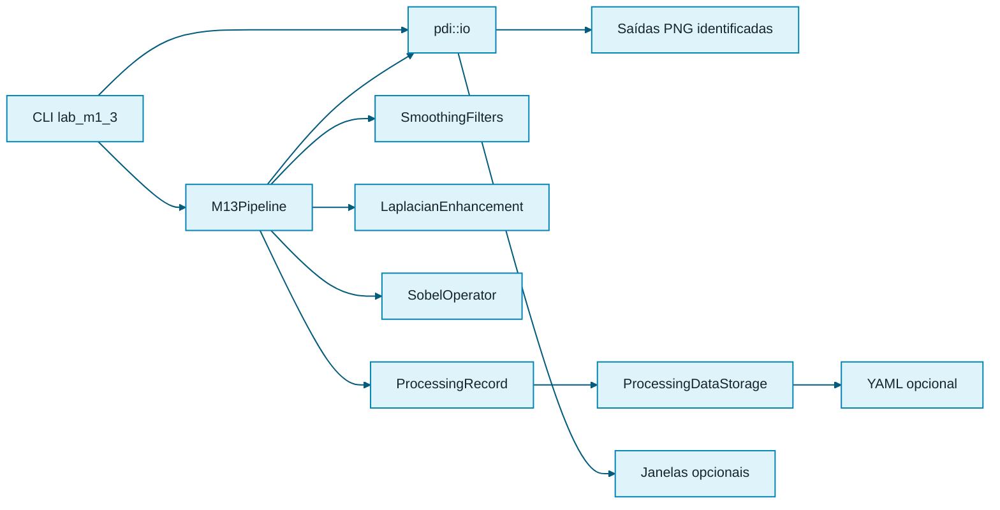

# Laboratório M1.3 — Integração e uso final

## Objetivo

O executável `lab_m1_3` reúne suavização, Laplaciano e Sobel em uma única
interface de linha de comando. O programa funciona sem interface gráfica por
padrão e reutiliza `pdi::io` para leitura, persistência e exibição opcional.

## Arquitetura



## Interface

```text
lab_m1_3 <entrada> <diretório-saída>
    --operation <mean3|weighted3|mean5|laplacian4|laplacian8|sobel>
    [--border <copy|replicate>]
    [--factor <valor>]
    [--show]
    [--save-data]
```

`--operation` é obrigatório.

`--border` controla a estratégia de borda e usa `replicate` por padrão.

`--factor` controla o realce Laplaciano e usa `1.0` por padrão. Para operações
não Laplacianas, o valor é aceito, mas não altera o resultado.

`--show` abre janelas apenas quando solicitado.

`--save-data` salva um YAML adicional sem alterar os PNGs nem exigir GUI.

## Saídas

Cada operação produz nomes inequívocos:

| Operação | Saídas |
|---|---|
| `mean3` | `mean_3x3.png` |
| `weighted3` | `weighted_mean_3x3.png` |
| `mean5` | `mean_5x5.png` |
| `laplacian4` | `laplacian_4_response.png`, `laplacian_4_enhanced.png` |
| `laplacian8` | `laplacian_8_response.png`, `laplacian_8_enhanced.png` |
| `sobel` | `sobel_gx.png`, `sobel_gy.png`, `sobel_magnitude_approximate.png`, `sobel_magnitude_euclidean.png` |

## Imagens sintéticas

O diretório `images/synthetic/m1_3` contém entradas reproduzíveis:

- transição vertical;
- impulso isolado;
- quadrado sobre fundo escuro.

Essas imagens permitem testar orientação, suavização e realce sem depender de
conteúdo externo ou licenças de terceiros.

## Preparação da versão 0.4.0

O patch atualiza o projeto para `0.4.0` e registra o fechamento do Laboratório
M1.3. Nenhuma tag Git é criada automaticamente. A tag deve ser criada somente
depois da validação completa em `main`.


## Dados numéricos

A suavização registra o kernel e sua soma. O Laplaciano registra kernel,
resposta bruta e realce antes da saturação. O Sobel registra kernels, gradientes
assinados e as duas magnitudes.

Os YAMLs são destinados a pequenas imagens, verificações numéricas e
rastreabilidade. PNG representa visualização; YAML preserva o dado numérico.
