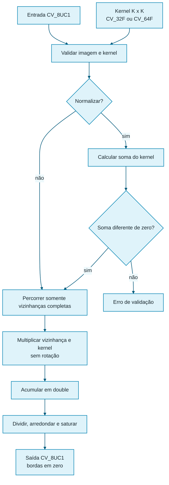
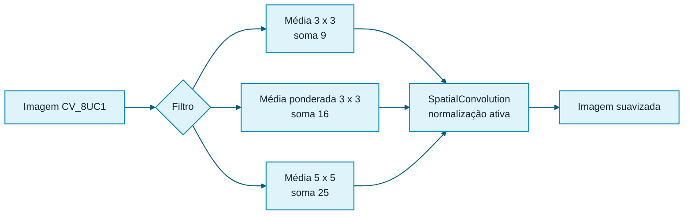
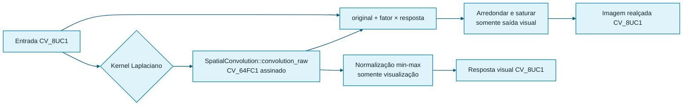
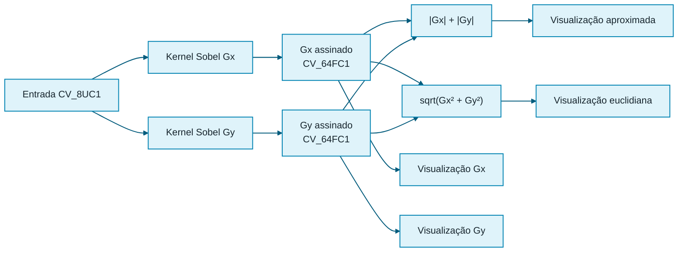

# Laboratório M1.3 — Núcleo de convolução espacial

## 1. Objetivo

Este incremento introduz o núcleo genérico utilizado pelos filtros espaciais do
Laboratório M1.3.

A API pública adota o nome `convolution`, coerente com a terminologia didática
do projeto. Entretanto, a implementação aplica o kernel exatamente na ordem em
que ele foi fornecido, sem realizar rotação de 180 graus.

Portanto, a operação calculada é tecnicamente uma **correlação espacial**.

Para kernels simétricos, como muitos kernels de média, suavização, Laplaciano e
alguns operadores de borda, a rotação não altera os coeficientes. Nesses casos,
a correlação espacial e a convolução matemática produzem o mesmo resultado.

## 2. Modelo de processamento

Para cada pixel que possui uma vizinhança completa:

1. posicionar o centro do kernel sobre o pixel;
2. multiplicar cada valor da vizinhança pelo coeficiente correspondente;
3. acumular os produtos em `double`;
4. normalizar pela soma do kernel, quando solicitado;
5. arredondar e saturar o resultado para `[0, 255]`.

O módulo oferece duas estratégias determinísticas de borda:

- `CopyBorder`: copia os pixels originais da borda e processa somente posições
  com vizinhança completa;
- `ReplicateBorder`: limita coordenadas externas ao pixel válido mais próximo e
  calcula toda a imagem.

## 3. Operação calculada

Para uma imagem `I`, um kernel `H` de dimensão ímpar `K x K` e raio
`r = floor(K / 2)`, o valor interno é:

```text
S(y, x) =
    soma de j = 0 até K - 1
    soma de i = 0 até K - 1
        I(y + j - r, x + i - r) × H(j, i)
```

Não se usa:

```text
H(K - 1 - j, K - 1 - i)
```

Logo, o kernel não é rotacionado.

Quando a normalização opcional está ativa:

```text
S_normalizado(y, x) = S(y, x) / soma(H)
```

A normalização é rejeitada quando a soma é zero ou numericamente próxima de
zero.

## 4. Pseudocódigo

```text
função convolution(imagem, kernel, normalizar, estratégia_borda):
    validar imagem CV_8UC1
    validar kernel quadrado, ímpar, flutuante e monocanal
    validar que kernel não é maior que imagem

    divisor <- 1

    se normalizar:
        divisor <- soma dos coeficientes do kernel

        se divisor for aproximadamente zero:
            lançar erro

    se estratégia_borda é CopyBorder:
        criar saída como cópia da entrada
        processar somente vizinhanças completas
    senão:
        criar saída CV_8UC1
        processar todas as posições
        limitar coordenadas externas ao índice válido mais próximo

    raio <- dimensão do kernel / 2

    para cada linha definida pela estratégia:
        obter ponteiro da linha de saída

        para cada coluna definida pela estratégia:
            acumulado <- 0 em double

            para linha_kernel de 0 até K - 1:
                linha_entrada <- linha + linha_kernel - raio
                obter ponteiro da linha de entrada

                para coluna_kernel de 0 até K - 1:
                    coluna_entrada <- coluna + coluna_kernel - raio

                    acumulado <- acumulado
                        + entrada[linha_entrada, coluna_entrada]
                        * kernel[linha_kernel, coluna_kernel]

            saída[linha, coluna] <-
                arredondar_e_saturar(acumulado / divisor)

    retornar saída
```

## 5. Fluxo



## 6. Estratégias de borda

### 6.1 `CopyBorder`

A saída começa como cópia da entrada. Somente posições com vizinhança completa
são processadas. Visualmente, a moldura externa permanece idêntica à imagem
original, o que pode criar uma transição entre a borda não filtrada e o
interior filtrado.

### 6.2 `ReplicateBorder`

Toda posição é processada. Coordenadas externas são limitadas ao índice válido
mais próximo. No canto superior esquerdo, posições negativas reutilizam a
linha 0 e a coluna 0.

Visualmente, o filtro alcança toda a imagem e tende a produzir transição mais
contínua. Entretanto, a repetição pode reforçar artificialmente estruturas que
tocam o contorno.

### 6.3 Diferenças visuais

`CopyBorder` preserva exatamente o contorno original e não cria amostras fora
da imagem. `ReplicateBorder` prolonga os valores da borda. A escolha depende do
filtro e do efeito visual desejado; nenhuma política é universalmente superior.

## 7. Normalização opcional

A normalização é útil quando o kernel representa uma soma que deve preservar a
escala média da imagem.

Exemplo de kernel de média não normalizado:

```text
1 1 1
1 1 1
1 1 1
```

A soma é 9. Com normalização ativada, o acumulado é dividido por 9.

Para kernels cuja soma é zero, como vários detectores de borda, essa forma de
normalização não é definida e deve permanecer desativada.

## 8. Correlação e convolução matemática

Uma convolução matemática discreta rotaciona o kernel em 180 graus antes da
aplicação.

A implementação deste projeto não realiza essa rotação. Isso permite manter a
correspondência direta entre:

```text
coeficiente exibido no kernel
posição acessada na vizinhança
```

Com um kernel assimétrico, correlação e convolução podem produzir respostas
diferentes.

Com um kernel simétrico:

```text
H(j, i) = H(K - 1 - j, K - 1 - i)
```

a rotação produz o mesmo kernel. Logo, os resultados coincidem.

## 9. Complexidade

Considere:

- `M`: quantidade de linhas;
- `N`: quantidade de colunas;
- `K`: dimensão do kernel quadrado.

Para cada pixel interno, são realizadas `K²` multiplicações e acumulações.

A complexidade temporal é:

```text
O(M N K²)
```

A saída requer uma nova matriz com `M × N` pixels:

```text
O(M N)
```

A memória adicional usada pelos acumuladores e índices é constante:

```text
O(1)
```

desconsiderando a matriz de saída.

## 10. Limites deste incremento

Este núcleo inicial:

- aceita somente entrada `CV_8UC1`;
- aceita kernels `CV_32FC1` e `CV_64FC1`;
- exige dimensão quadrada e ímpar;
- não usa `cv::filter2D`;
- oferece `CopyBorder` e `ReplicateBorder`;
- não usa `cv::copyMakeBorder`;
- não define ainda uma biblioteca de kernels;
- não cria ainda o executável integrado do M1.3.


## 11. Filtros de suavização

Os filtros de suavização reduzem variações locais ao substituir cada pixel por
uma combinação dos valores de sua vizinhança. Eles podem atenuar ruído, mas
também removem detalhes, texturas e transições abruptas.

Todos os filtros desta seção reutilizam `SpatialConvolution` com normalização
ativada.

### 11.1 Média uniforme `3 x 3`

Kernel legível:

```text
1 1 1
1 1 1
1 1 1
```

A soma é `9`; portanto, o acumulado é dividido por `9`.

Cada posição possui o mesmo peso. O filtro reduz ruído local, mas suaviza
bordas e detalhes finos.

### 11.2 Média ponderada `3 x 3`

Kernel:

```text
1 2 1
2 4 2
1 2 1
```

A soma é `16`. O pixel central recebe peso `4`, os vizinhos ortogonais recebem
peso `2` e os diagonais recebem peso `1`.

Em comparação com a média uniforme `3 x 3`, esse filtro tende a preservar mais
a contribuição do centro e produzir suavização menos agressiva sobre detalhes
pequenos.

### 11.3 Média uniforme `5 x 5`

Kernel:

```text
1 1 1 1 1
1 1 1 1 1
1 1 1 1 1
1 1 1 1 1
1 1 1 1 1
```

A soma é `25`. A vizinhança maior combina mais pixels e tende a reduzir mais o
ruído, porém causa maior perda de detalhes e maior alargamento de bordas.

### 11.4 Comparação de custo

Para uma imagem `M x N`, o custo dominante é proporcional à quantidade de
coeficientes:

| Filtro | Multiplicações por pixel | Custo assintótico |
|---|---:|---:|
| Média `3 x 3` | 9 | `O(9MN)` |
| Média ponderada `3 x 3` | 9 | `O(9MN)` |
| Média `5 x 5` | 25 | `O(25MN)` |

Os três permanecem em `O(MN)` quando o tamanho do kernel é tratado como
constante. Entretanto, a média `5 x 5` executa aproximadamente `25/9`, ou
`2,78`, vezes a quantidade de multiplicações dos filtros `3 x 3`.

### 11.5 Redução de ruído e perda de detalhes

A média uniforme reduz variações rápidas, incluindo parte do ruído impulsivo ou
aditivo, mas não diferencia ruído de detalhes legítimos.

O filtro ponderado `3 x 3` mantém maior influência do pixel central. Ele tende a
preservar melhor pequenos detalhes, embora reduza menos agressivamente certas
variações.

A média `5 x 5` usa uma região maior. Ela geralmente produz uma imagem mais
suave, mas pode:

- apagar texturas;
- fundir estruturas próximas;
- enfraquecer bordas;
- remover objetos pequenos;
- deslocar a interpretação visual de regiões estreitas.

### 11.6 Exemplo reproduzível

```bash
./build/ucrt64-debug/lab_m1_3_smoothing.exe \
    images/input/example.png \
    images/output/m1_3_smoothing
```

Saídas:

```text
mean_3x3.png
weighted_mean_3x3.png
mean_5x5.png
```

Com exibição opcional:

```bash
./build/ucrt64-debug/lab_m1_3_smoothing.exe \
    images/input/example.png \
    images/output/m1_3_smoothing \
    --show
```

### 11.7 Fluxo dos filtros




## 12. Laplaciano e realce

O Laplaciano estima variações de segunda ordem. Em regiões aproximadamente
constantes, sua resposta tende a zero. Próximo a transições, a resposta pode
ser positiva ou negativa.

### 12.1 Kernels

Quatro vizinhos:

```text
 0 -1  0
-1  4 -1
 0 -1  0
```

Oito vizinhos:

```text
-1 -1 -1
-1  8 -1
-1 -1 -1
```

Os dois kernels são simétricos; portanto, a correlação espacial implementada
pelo projeto coincide com a convolução matemática.

### 12.2 Resposta assinada

A resposta Laplaciana é produzida como `CV_64FC1`. Ela não é convertida
prematuramente para `uchar`.

Isso é essencial porque valores negativos representam uma das polaridades da
variação local. Uma conversão antecipada para `[0, 255]` destruiria essa
informação.

### 12.3 Realce

Com os kernels de centro positivo usados neste projeto:

```text
imagem_realçada = imagem_original + fator × resposta_laplaciana
```

O fator controla a intensidade:

- `0.0`: preserva a imagem original;
- valores entre `0.0` e `1.0`: realce moderado;
- `1.0`: resposta completa;
- valores maiores podem produzir realce forte e saturação.

A combinação é calculada em `double`. Somente a saída visual final é
arredondada e saturada para `[0, 255]`.

### 12.4 Saturação da saída visual

Quando a combinação resulta em valor negativo, a imagem visual armazena `0`.
Quando ultrapassa `255`, armazena `255`.

A saturação é necessária para gerar `CV_8UC1`, mas significa perda de
informação numérica. Por isso, a resposta bruta assinada permanece separada.

### 12.5 Visualização da resposta bruta

Para salvar ou exibir a resposta, é criada uma imagem min-max:

```text
visual = (resposta - mínimo) × 255 / (máximo - mínimo)
```

Essa imagem serve apenas para visualização. Um tom intermediário não representa
necessariamente resposta zero, pois o mapeamento depende do mínimo e máximo de
cada imagem.

### 12.6 Fluxo



### 12.7 Exemplo reproduzível

```bash
./build/ucrt64-debug/lab_m1_3_laplacian.exe \
    images/input/example.png \
    images/output/m1_3_laplacian \
    1.0
```

O valor `1.0` é o fator de realce.

Não é utilizada a função `cv::Laplacian`.


## 13. Operador Sobel

O operador Sobel estima a primeira derivada da intensidade em duas direções.
Ele combina diferenciação e uma pequena suavização transversal.

### 13.1 Kernel `Gx`

```text
-1  0  1
-2  0  2
-1  0  1
```

`Gx` mede a variação ao longo do eixo horizontal da imagem. Uma resposta de
grande módulo indica mudança entre colunas vizinhas. Por isso, `Gx` destaca
principalmente bordas de orientação vertical.

O sinal informa a direção da transição:

- resposta positiva: a intensidade aumenta da esquerda para a direita;
- resposta negativa: a intensidade diminui da esquerda para a direita.

### 13.2 Kernel `Gy`

```text
-1 -2 -1
 0  0  0
 1  2  1
```

`Gy` mede a variação ao longo do eixo vertical da imagem. Ele destaca
principalmente bordas de orientação horizontal.

O sinal indica a direção da transição:

- resposta positiva: a intensidade aumenta de cima para baixo;
- resposta negativa: a intensidade diminui de cima para baixo.

### 13.3 Preservação do sinal

Os gradientes são calculados por `SpatialConvolution::convolution_raw` e
mantidos em `CV_64FC1`.

Não ocorre conversão prematura para `uchar`. Portanto, valores negativos
continuam disponíveis para análise da direção da mudança.

As imagens `Gx` e `Gy` salvas são normalizações min-max usadas apenas para
visualização.

### 13.4 Magnitude aproximada

```text
M_aproximada = |Gx| + |Gy|
```

Vantagens:

- usa módulos e soma;
- evita raiz quadrada;
- é computacionalmente mais simples;
- tende a produzir valor maior ou igual à magnitude euclidiana.

Desvantagem:

- superestima a magnitude quando `Gx` e `Gy` são simultaneamente relevantes;
- sua resposta depende mais da orientação da borda.

### 13.5 Magnitude euclidiana

```text
M_euclidiana = sqrt(Gx² + Gy²)
```

Ela representa a norma geométrica do vetor gradiente e varia de forma mais
consistente com a orientação.

Seu custo é maior por exigir duas multiplicações, uma soma e uma raiz quadrada
por pixel.

### 13.6 Comparação numérica

Para:

```text
Gx = 80
Gy = 80
```

temos:

```text
M_aproximada = 160
M_euclidiana = sqrt(12800) ≈ 113,14
```

Quando apenas uma componente é diferente de zero, as duas magnitudes
coincidem.

### 13.7 Orientação das bordas

A direção do vetor gradiente aponta para a direção de maior aumento da
intensidade. A borda visual é aproximadamente perpendicular a esse vetor.

Assim:

```text
Gx forte, Gy pequeno -> borda predominantemente vertical
Gy forte, Gx pequeno -> borda predominantemente horizontal
Gx e Gy fortes       -> borda inclinada
```

### 13.8 Fluxo



### 13.9 Exemplo reproduzível

```bash
./build/ucrt64-debug/lab_m1_3_sobel.exe \
    images/input/example.png \
    images/output/m1_3_sobel
```

Não é utilizada a função `cv::Sobel`.
