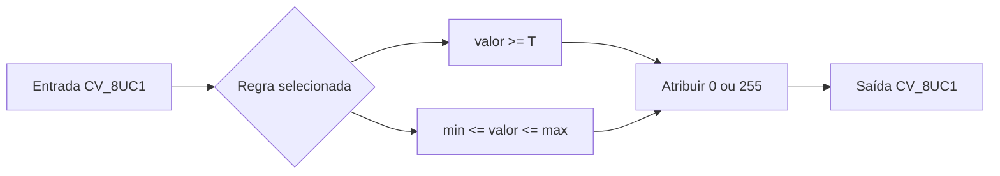

# Laboratório M2.1 — Limiarização manual

## 1. Objetivo

A limiarização transforma uma imagem em níveis de cinza em uma imagem binária.
Cada pixel é classificado como fundo ou primeiro plano a partir de uma regra
sobre sua intensidade.

Neste componente, a entrada e a saída possuem tipo `CV_8UC1`. A saída contém
exclusivamente:

```text
0   -> fundo
255 -> primeiro plano
```

A implementação percorre os pixels manualmente e não utiliza `cv::threshold`.

## 2. Limiarização binária global

Um único limiar `T` é aplicado em toda a imagem:

```text
g(x, y) = 255, quando f(x, y) >= T
g(x, y) =   0, quando f(x, y) <  T
```

A igualdade pertence ao primeiro plano. Portanto, para `T = 100`:

```text
99  -> 0
100 -> 255
101 -> 255
```

Essa convenção deve ser mantida nos testes, na documentação e nas aplicações
que reutilizarem o componente.

### Interpretação

A limiarização global é adequada quando existe separação razoável entre as
intensidades do objeto e do fundo. Ela tende a falhar quando:

- a iluminação varia pela imagem;
- objeto e fundo possuem intensidades sobrepostas;
- existe ruído;
- sombras alteram localmente os valores;
- o limiar é escolhido sem analisar os dados.

## 3. Seleção por intervalo

A seleção por intervalo mantém como primeiro plano apenas os valores em:

```text
[minimum_value, maximum_value]
```

As duas fronteiras são inclusivas:

```text
g(x, y) = 255, quando minimum_value <= f(x, y) <= maximum_value
g(x, y) =   0, nos demais casos
```

Para o intervalo `[50, 150]`:

```text
49  -> 0
50  -> 255
150 -> 255
151 -> 0
```

Um intervalo com limites iguais é válido e seleciona uma intensidade única:

```text
[42, 42]
```

Um intervalo invertido é inválido:

```text
minimum_value > maximum_value
```

## 4. Fluxo



## 5. Complexidade

Cada pixel é visitado uma vez.

Para uma imagem com `M` linhas e `N` colunas:

```text
tempo:  O(MN)
espaço: O(MN)
```

O espaço adicional corresponde à imagem de saída.

## 6. Validação numérica

Os testes devem incluir:

- valor imediatamente abaixo do limiar;
- valor exatamente igual ao limiar;
- valor imediatamente acima do limiar;
- limiares `0` e `255`;
- limites inferior e superior do intervalo;
- intervalo de intensidade única;
- intervalo invertido;
- imagem colorida;
- imagem em ponto flutuante.

## 7. Exemplo de uso

```cpp
const pdi::segmentation::ManualThreshold thresholding;

const cv::Mat global = thresholding.binary_global(
    input_image,
    128
);

const cv::Mat selected = thresholding.select_interval(
    input_image,
    80,
    160
);
```

## 8. Restrições didáticas

Não utilizar:

```cpp
cv::threshold
cv::inRange
```

`cv::inRange` não foi solicitado explicitamente, mas também executaria
diretamente a seleção por intervalo estudada. A lógica deve permanecer manual.

O OpenCV é utilizado para representar as matrizes, enquanto a decisão binária
é implementada pelo percurso explícito dos pixels.
