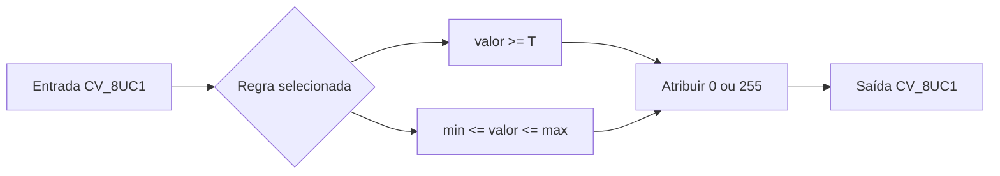
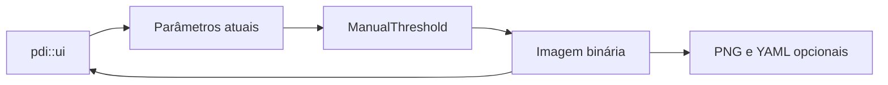
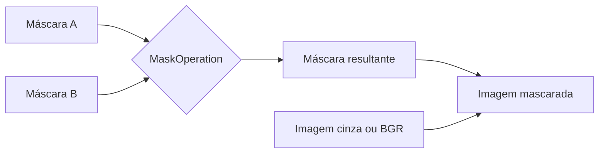
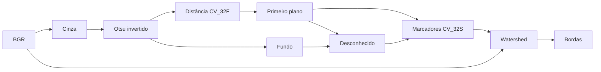

# Laboratório M2.1 — Limiarização manual

## 1. Objetivo

A limiarização transforma uma imagem em níveis de cinza em uma imagem binária.
Cada pixel é classificado como fundo ou primeiro plano a partir de uma regra
sobre sua intensidade.

Neste componente, a entrada e a saída possuem tipo `CV_8UC1`. A saída contém
exclusivamente:

```text
0   -> fundo
255 -> primeiro plano
```

A implementação percorre os pixels manualmente e não utiliza `cv::threshold`.

## 2. Limiarização binária global

Um único limiar `T` é aplicado em toda a imagem:

```text
g(x, y) = 255, quando f(x, y) >= T
g(x, y) =   0, quando f(x, y) <  T
```

A igualdade pertence ao primeiro plano. Portanto, para `T = 100`:

```text
99  -> 0
100 -> 255
101 -> 255
```

Essa convenção deve ser mantida nos testes, na documentação e nas aplicações
que reutilizarem o componente.

### Interpretação

A limiarização global é adequada quando existe separação razoável entre as
intensidades do objeto e do fundo. Ela tende a falhar quando:

- a iluminação varia pela imagem;
- objeto e fundo possuem intensidades sobrepostas;
- existe ruído;
- sombras alteram localmente os valores;
- o limiar é escolhido sem analisar os dados.

## 3. Seleção por intervalo

A seleção por intervalo mantém como primeiro plano apenas os valores em:

```text
[minimum_value, maximum_value]
```

As duas fronteiras são inclusivas:

```text
g(x, y) = 255, quando minimum_value <= f(x, y) <= maximum_value
g(x, y) =   0, nos demais casos
```

Para o intervalo `[50, 150]`:

```text
49  -> 0
50  -> 255
150 -> 255
151 -> 0
```

Um intervalo com limites iguais é válido e seleciona uma intensidade única:

```text
[42, 42]
```

Um intervalo invertido é inválido:

```text
minimum_value > maximum_value
```

## 4. Fluxo



## 5. Complexidade

Cada pixel é visitado uma vez.

Para uma imagem com `M` linhas e `N` colunas:

```text
tempo:  O(MN)
espaço: O(MN)
```

O espaço adicional corresponde à imagem de saída.

## 6. Validação numérica

Os testes devem incluir:

- valor imediatamente abaixo do limiar;
- valor exatamente igual ao limiar;
- valor imediatamente acima do limiar;
- limiares `0` e `255`;
- limites inferior e superior do intervalo;
- intervalo de intensidade única;
- intervalo invertido;
- imagem colorida;
- imagem em ponto flutuante.

## 7. Exemplo de uso

```cpp
const pdi::segmentation::ManualThreshold thresholding;

const cv::Mat global = thresholding.binary_global(
    input_image,
    128
);

const cv::Mat selected = thresholding.select_interval(
    input_image,
    80,
    160
);
```

## 8. Restrições didáticas

Não utilizar:

```cpp
cv::threshold
cv::inRange
```

`cv::inRange` não foi solicitado explicitamente, mas também executaria
diretamente a seleção por intervalo estudada. A lógica deve permanecer manual.

O OpenCV é utilizado para representar as matrizes, enquanto a decisão binária
é implementada pelo percurso explícito dos pixels.

## 9. Demonstração interativa opcional

Quando `PDI_BUILD_INTERACTIVE_UI` estiver habilitado, o executável
`lab_m2_1_interactive` permite explorar a limiarização sem alterar
`ManualThreshold`.

```bash
./build/ucrt64-debug-ui/lab_m2_1_interactive.exe \
    images/input/example.png \
    images/output/m2_1 \
    --interactive \
    --save-data
```

Controles:

```text
Trackbars  limiar, mínimo e máximo
M          alterna global e intervalo
R          redefine os parâmetros
S          salva o estado atual
Q ou Esc   encerra
Mouse      inspeciona a intensidade da entrada
```

Se o backend Qt estiver disponível, a demonstração também adiciona checkbox e
botão. Sem Qt, trackbars, mouse e teclado continuam sendo usados.


## 10. Operações manuais com máscaras

Uma máscara binária é uma imagem `CV_8UC1` formada exclusivamente por `0` e
`255`. Neste projeto:

```text
0   -> região excluída
255 -> região selecionada
```

A validação rejeita valores intermediários para evitar que uma máscara em
níveis de cinza seja interpretada silenciosamente como binária.

### Operações lógicas

Para dois pixels binários `A` e `B`:

| A | B | interseção | união | diferença A \ B |
|---:|---:|---:|---:|---:|
| 0 | 0 | 0 | 0 | 0 |
| 0 | 255 | 0 | 255 | 0 |
| 255 | 0 | 0 | 255 | 255 |
| 255 | 255 | 255 | 255 | 0 |

A diferença é direcional e não comutativa:

```text
A \ B != B \ A
```

A inversão troca os dois estados:

```text
0   -> 255
255 -> 0
```

As operações são implementadas por percurso explícito. Não são utilizadas
funções como:

```cpp
cv::bitwise_not
cv::bitwise_and
cv::bitwise_or
cv::bitwise_xor
```

### Aplicação da máscara

Na imagem em níveis de cinza:

```text
saída(x, y) = entrada(x, y), quando máscara(x, y) = 255
saída(x, y) = 0,             quando máscara(x, y) = 0
```

Na imagem colorida, a mesma decisão é aplicada ao pixel BGR completo. Não há
laço genérico de canais: os índices `[0]`, `[1]` e `[2]` são copiados
explicitamente.



### Preparação para interação

A enumeração `MaskOperation` identifica a operação sem depender da interface.
Uma aplicação futura poderá mapear CLI, teclado, trackbar, botão ou checkbox
para essa enumeração. `MaskOperations` não conhece `pdi::ui`, janelas ou
callbacks.

### Complexidade

Cada operação visita cada pixel uma vez. Para imagens com `M` linhas e `N`
colunas:

```text
tempo:  O(MN)
espaço: O(MN)
```

## 11. Métodos de segmentação usando biblioteca

Este incremento separa dois grupos:

```text
manual:
- ManualThreshold
- MaskOperations

baseado em biblioteca:
- LibrarySegmentationPipeline
```

O pipeline de biblioteca não contém HighGUI nem persistência. Ele devolve
saídas visuais, parâmetros e matrizes numéricas; o executável decide quando
salvar PNG e YAML.

### BGR para HSV

`cv::cvtColor(..., COLOR_BGR2HSV)` separa matiz, saturação e valor. A matriz HSV
original é preservada no YAML, enquanto os canais e uma reconversão para BGR
servem como visualização.

Limitação: matiz no OpenCV de 8 bits usa `[0, 179]`, e a conversão depende da
iluminação e da saturação.

### Otsu

O método seleciona automaticamente um limiar global a partir do histograma. O
valor retornado por `cv::threshold` é registrado como parâmetro.

Limitação: funciona melhor quando o histograma apresenta grupos relativamente
separáveis; iluminação não uniforme pode degradar o resultado.

### Limiarização adaptativa

A média local é calculada em uma vizinhança ímpar e o parâmetro `C` desloca o
limiar local. `block_size` e `constant_c` permanecem explícitos e preparados
para controle interativo futuro.

Limitação: vizinhanças pequenas podem responder excessivamente ao ruído;
vizinhanças grandes podem perder variações locais.

### Transformada de distância

`cv::distanceTransform` recebe uma imagem binária e produz `CV_32FC1`. O PNG
normalizado é apenas visual; a matriz flutuante original é o artefato numérico.

### Watershed

O exemplo expõe as etapas:

1. conversão para cinza;
2. Otsu invertido;
3. transformada de distância;
4. primeiro plano confiável;
5. fundo confiável por dilatação;
6. região desconhecida;
7. componentes conexos usados como marcadores;
8. `cv::watershed`;
9. bordas marcadas em vermelho.



Limitações: o resultado depende da qualidade dos marcadores, do limiar de
primeiro plano, da separação entre objetos e do pré-processamento.

### Persistência

```text
PNG  -> visualizações intermediárias
YAML -> parâmetros e matrizes numéricas originais
```

Exemplo:

```bash
lab_m2_1_library input.png output/ watershed \
    --foreground-ratio 0.4 \
    --save-data
```

A enumeração `LibrarySegmentationOperation` e a estrutura
`LibrarySegmentationParameters` não dependem de GUI. Uma interface futura pode
alterar os mesmos parâmetros e solicitar nova execução sem mover HighGUI para
o pipeline.
