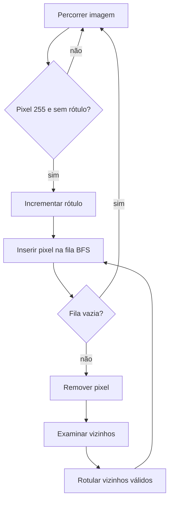

# Laboratório M2.2 — Componentes conexos

## Rotulação manual

A primeira etapa do Laboratório M2.2 implementa a rotulação manual de
componentes conexos em imagens binárias `CV_8UC1`. O fundo usa intensidade
zero, o objeto usa intensidade 255 e o rótulo zero permanece reservado ao
fundo na matriz `CV_32SC1`.

A implementação percorre a imagem em ordem de linhas. Ao encontrar um pixel de
objeto ainda sem rótulo, inicia uma busca em largura (BFS — Breadth-First
Search), atribui um novo rótulo positivo e visita todos os vizinhos conectados.
Nenhuma função `cv::connectedComponents` é utilizada.



## Conectividade 4 e 8

Na conectividade 4, cada pixel considera apenas os vizinhos acima, abaixo, à
esquerda e à direita. Pixels que se tocam somente pelas diagonais pertencem a
componentes diferentes.

Na conectividade 8, as quatro diagonais também são consideradas. Assim, pixels
com contato diagonal podem pertencer ao mesmo componente.

Exemplo:

```text
255   0
  0 255
```

- conectividade 4: dois componentes;
- conectividade 8: um componente.

A enumeração `Connectivity` mantém essa decisão desacoplada de linha de
comando, trackbar, botão ou outro mecanismo de interface. Da mesma forma,
`select_component` recebe apenas a matriz de rótulos e um rótulo positivo,
permitindo que uma futura interface interativa altere a seleção sem modificar o
algoritmo de rotulação.

## Complexidade

Para uma imagem com `M` linhas e `N` colunas, cada pixel é examinado uma
quantidade constante de vezes. A complexidade temporal é `O(MN)` para as duas
conectividades. A matriz de rótulos e a fila da BFS podem utilizar `O(MN)` de
memória auxiliar no pior caso.

## Características dos componentes

`ComponentFeatureExtractor` percorre a matriz `CV_32SC1` e ignora o rótulo
zero. Para cada rótulo positivo, acumula quantidade de pixels, extremos de
linha e coluna e somas de coordenadas.

A área corresponde à quantidade de pixels. A caixa delimitadora usa
`(x, y, largura, altura)`. O centroide é calculado por:

```text
centroid_x = soma_das_colunas / área
centroid_y = soma_das_linhas / área
```

`ComponentFeaturesCsvStorage` mantém a representação tabular com uma linha por
componente. O YAML não substitui o CSV: um `ProcessingRecord` complementar
registra conectividade, quantidade de componentes, estatísticas agregadas e a
matriz de rótulos original.

A extração possui complexidade temporal `O(MN + K)` e memória auxiliar `O(K)`,
em que `K` representa a quantidade de posições de acumulação por rótulo.
