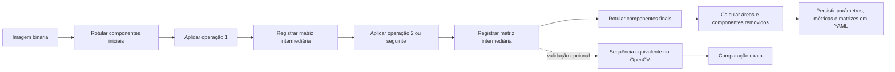
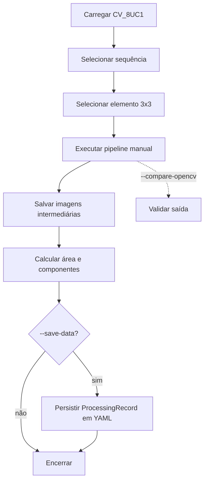
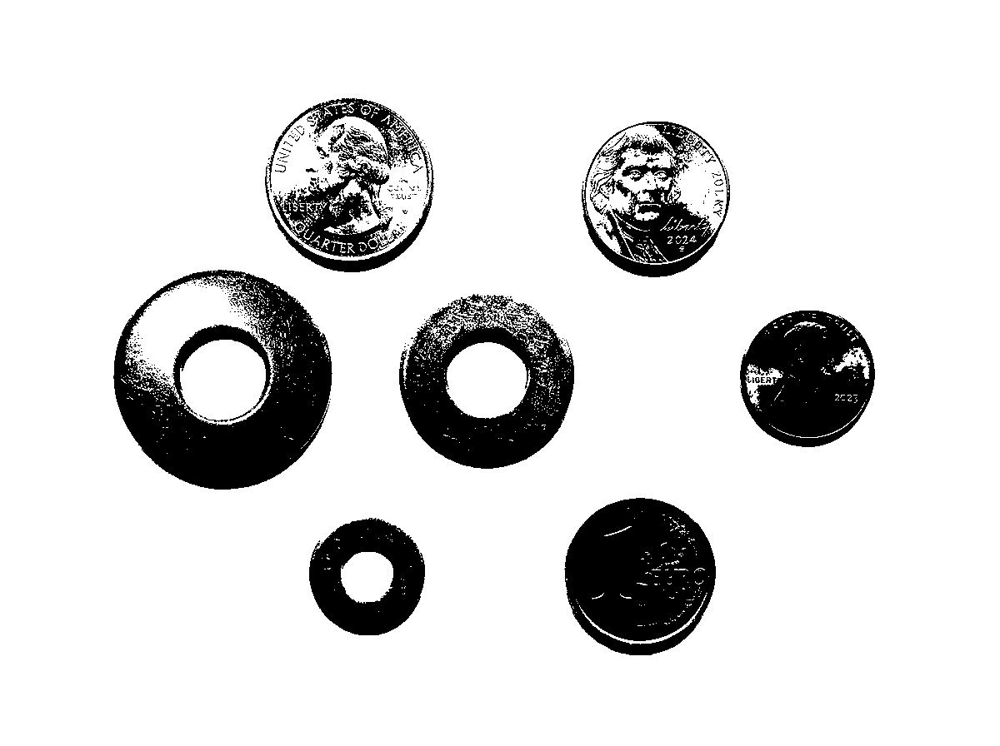
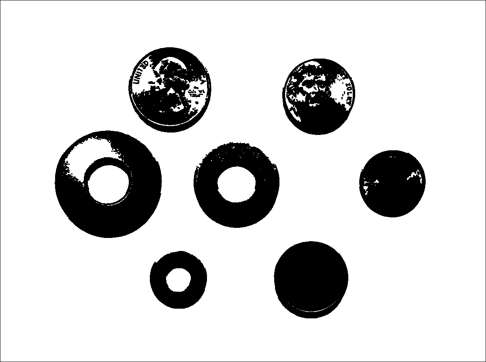
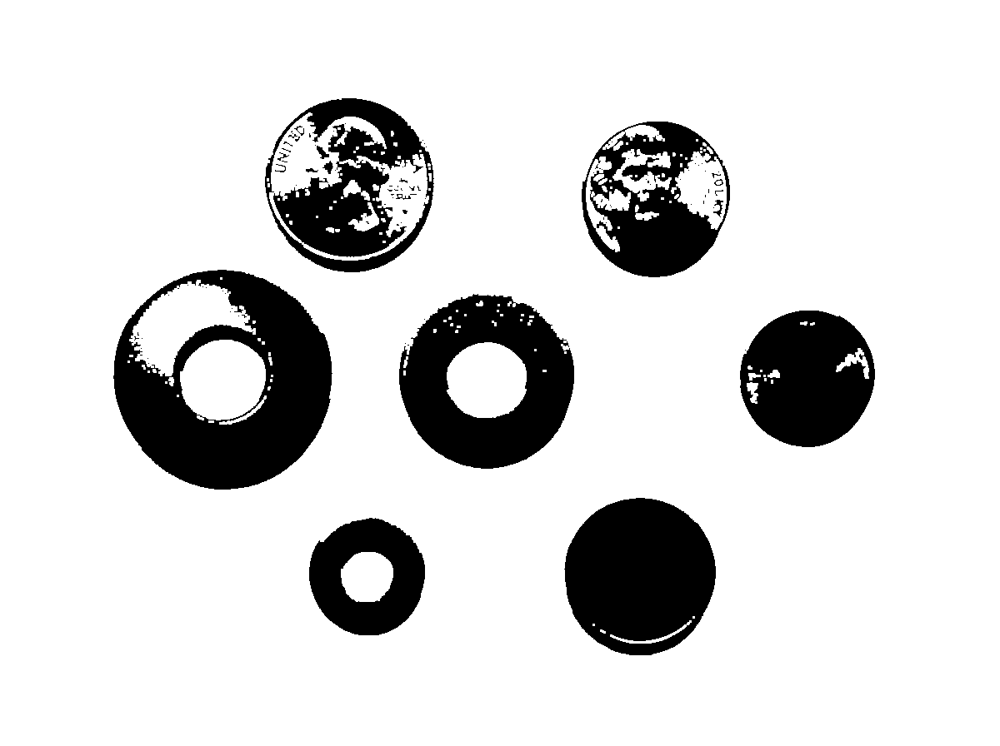
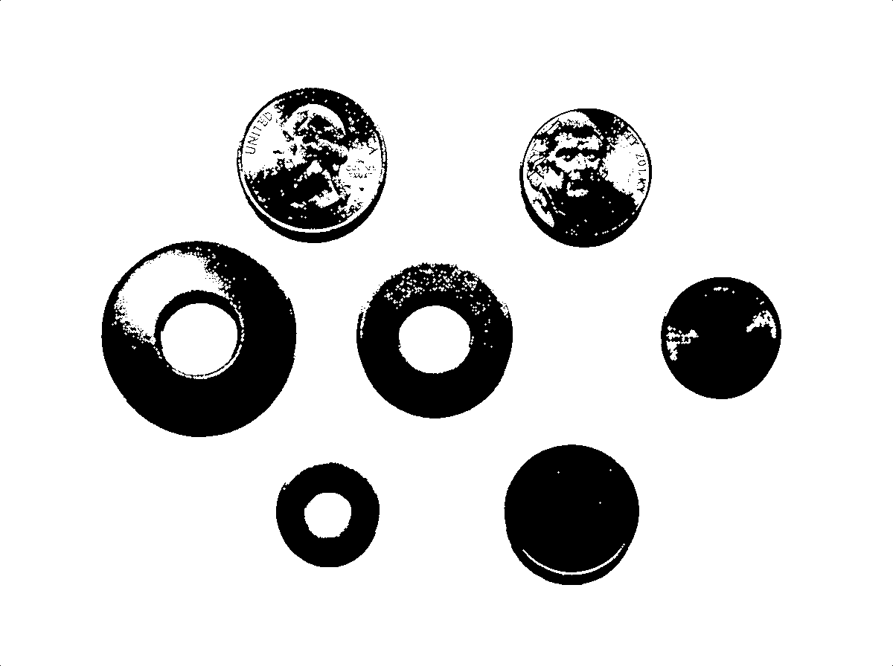
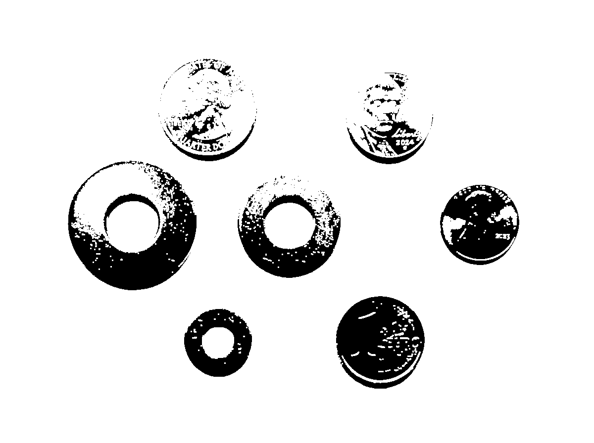
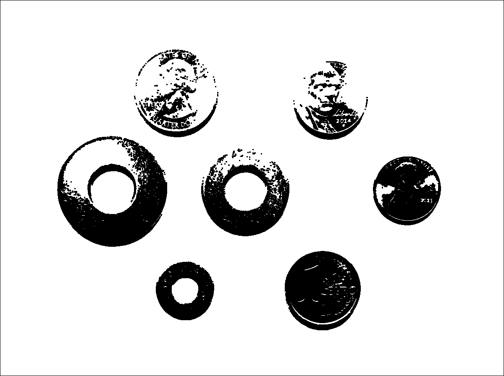
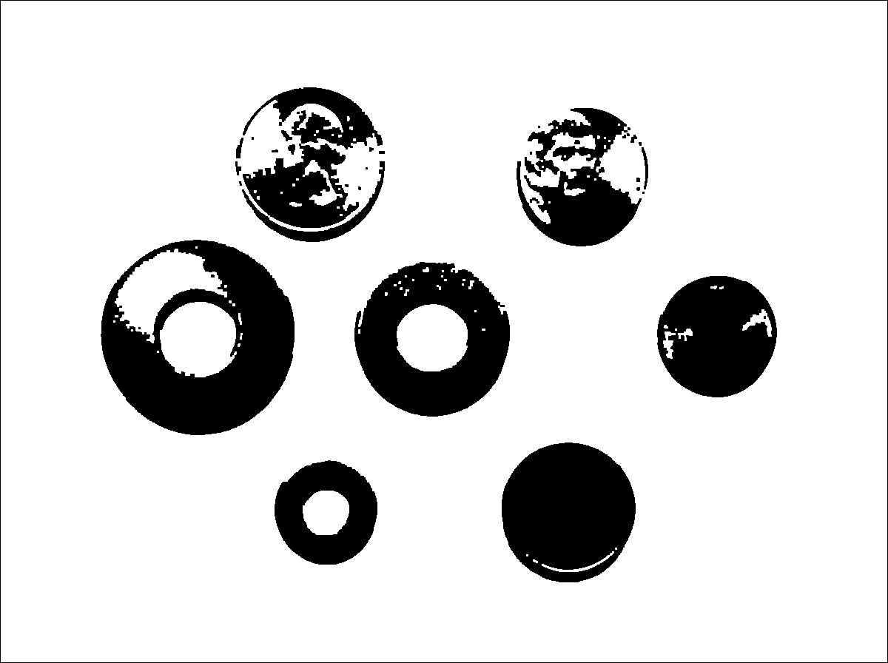

# Laboratório M2.3 — Morfologia matemática binária

## Erosão e dilatação manuais

A primeira etapa do Laboratório M2.3 implementa erosão e dilatação para imagens
binárias `CV_8UC1`, com valores 0 para fundo e 255 para objeto. Nenhuma chamada
a `cv::erode` ou `cv::dilate` é utilizada.

## Elemento estruturante

`BinaryStructuringElement` mantém a máscara binária e a âncora. O suporte
inicial está restrito a `3 x 3`, com fábricas para quadrado completo e cruz.

A estrutura não conhece interface gráfica, linha de comando, trackbar ou botão.
Uma interface futura poderá substituir o elemento estruturante e reexecutar o
algoritmo sem alterar o núcleo morfológico.

## Estratégia de borda

A estratégia inicial é `OutsideBackground`: qualquer posição fora da imagem é
interpretada como fundo, com valor zero.

Na erosão, um pixel de saída é 255 somente quando todas as posições ativas do
elemento estruturante coincidem com pixels 255 dentro da imagem. Na dilatação,
um pixel de saída é 255 quando pelo menos uma posição ativa coincide com um
pixel 255 válido.

## Complexidade

Para uma imagem `M x N` e um elemento com `K` posições, o custo é `O(MNK)`.
Como o escopo inicial fixa `K = 9`, o tempo é linear em relação à quantidade de
pixels. A saída utiliza `O(MN)` de memória.

## Abertura e fechamento

As operações compostas reutilizam exclusivamente `erode` e `dilate`; não existe
uma segunda implementação dos percursos de vizinhança.

A abertura aplica:

```text
opening(image, element) = dilate(erode(image, element), element)
```

A erosão ocorre primeiro, removendo detalhes de objeto que não comportam o
elemento estruturante. A dilatação ocorre depois, restaurando aproximadamente o
tamanho das regiões sobreviventes.

Exemplo visual simplificado, em que `1` representa objeto:

```text
entrada              após abertura
0 0 0 0 0            0 0 0 0 0
0 1 1 1 0            0 1 1 1 0
0 1 1 1 1            0 1 1 1 0
0 1 1 1 0            0 1 1 1 0
0 0 0 0 0            0 0 0 0 0
```

O pixel isolado à direita é removido porque não sobrevive à erosão.

O fechamento aplica:

```text
closing(image, element) = erode(dilate(image, element), element)
```

A dilatação ocorre primeiro, preenchendo pequenos vazios e estreitando
interrupções. A erosão ocorre depois, reduzindo o crescimento externo.

```text
entrada              após fechamento
0 0 0 0 0            0 0 0 0 0
0 1 1 1 0            0 1 1 1 0
0 1 0 1 0            0 1 1 1 0
0 1 1 1 0            0 1 1 1 0
0 0 0 0 0            0 0 0 0 0
```

O pequeno vazio central é preenchido. A ordem não é intercambiável: abertura e
fechamento produzem efeitos morfológicos diferentes mesmo usando a mesma imagem,
o mesmo elemento estruturante e a mesma estratégia de borda.


## Pipeline morfológico configurável

`MorphologicalPipeline` recebe um elemento estruturante, uma estratégia de
borda, conectividade para análise de componentes e uma sequência com pelo menos
duas operações. Cada estágio reutiliza `BinaryMorphology`; portanto, os
algoritmos de erosão e dilatação não são duplicados.



### Remoção de ruído

O preset `noise_removal_3x3` usa `erode -> dilate`, equivalente à abertura
manual. A erosão elimina componentes e saliências menores que o elemento
estruturante; a dilatação recompõe as regiões que sobreviveram. Essa ordem é
indicada para ruído claro isolado sobre fundo escuro.

### Preenchimento de pequenos buracos

O preset `hole_filling_3x3` usa `dilate -> erode`, equivalente ao fechamento
manual. A dilatação fecha lacunas pequenas e a erosão reduz o crescimento
externo introduzido no primeiro estágio. Essa ordem é indicada para pequenos
buracos escuros em regiões de primeiro plano.

### Métricas e rastreabilidade

Antes e depois da sequência são registrados:

- área de primeiro plano;
- quantidade de componentes conexos;
- quantidade e rótulos dos componentes iniciais completamente removidos;
- matriz do elemento estruturante;
- imagem de entrada, cada matriz intermediária e imagem final;
- matrizes de rótulos inicial e final;
- sequência, borda, conectividade e resultado da validação opcional.

A validação com OpenCV é desativada por padrão. Quando habilitada, executa uma
sequência equivalente apenas como referência e compara a saída final pixel a
pixel. Ela não substitui as implementações manuais.


## Executável integrado

O executável final é:

```bash
lab_m2_3 <entrada> <diretório-saída> [opções]
```

Opções principais:

- `--sequence noise-removal|hole-filling|open-close|close-open`;
- `--element square|cross`;
- `--connectivity 4|8`;
- `--compare-opencv`;
- `--show`;
- `--interactive`;
- `--save-data`.

A execução sempre salva `input.png`, `stage_1.png`, as demais matrizes
intermediárias e `output.png`. Com `--save-data`, também grava
`m2_3_result.yml` por meio de `pdi::io::ProcessingDataStorage`.

O modo interativo utiliza trackbars HighGUI para selecionar a sequência, o
elemento estruturante e a conectividade. Os parâmetros efetivamente selecionados
ao fechar a janela são os mesmos usados no relatório final, nas imagens e no
`ProcessingRecord`. Não há uso incondicional de botões ou checkboxes; controles
Qt só poderão ser incorporados futuramente após consulta explícita às
capacidades do backend.



## Resultados processados curados

A entrada binária é a máscara manual favorável gerada no M2.1. As sequências
foram comparadas com OpenCV e todas registraram correspondência positiva.

```bash
./build/ucrt64-debug/lab_m2_3.exe \
    images/output/prompt_33_4/m2_1/favoravel/manual/manual_global_binary.png \
    images/output/prompt_33_4/m2_3/noise_square \
    --sequence noise-removal --element square --connectivity 8 \
    --compare-opencv --save-data

./build/ucrt64-debug/lab_m2_3.exe \
    images/output/prompt_33_4/m2_1/favoravel/manual/manual_global_binary.png \
    images/output/prompt_33_4/m2_3/hole_filling_square \
    --sequence hole-filling --element square --connectivity 8 \
    --compare-opencv --save-data
```

### Remoção de ruído

<div class="pdi_gallery_grid">
<div class="pdi_gallery_card">
<a class="pdi_gallery_link" href="../images/results/m2_3/input_binary.png">

</a>
<div class="pdi_gallery_caption">Entrada: máscara manual do caso favorável do M2.1.</div>
</div>
<div class="pdi_gallery_card">
<a class="pdi_gallery_link" href="../images/results/m2_3/noise_square_stage_1.png">

</a>
<div class="pdi_gallery_caption">Estágio 1, erosão: remove pontos pequenos e reduz regiões.</div>
</div>
<div class="pdi_gallery_card">
<a class="pdi_gallery_link" href="../images/results/m2_3/noise_square_stage_2.png">

</a>
<div class="pdi_gallery_caption">Estágio 2, dilatação: recompõe parcialmente as regiões sobreviventes.</div>
</div>
<div class="pdi_gallery_card">
<a class="pdi_gallery_link" href="../images/results/m2_3/noise_square_output.png">

</a>
<div class="pdi_gallery_caption">Quadrado 3 × 3: componentes 1372 → 128; área 931434 → 915640.</div>
</div>
<div class="pdi_gallery_card">
<a class="pdi_gallery_link" href="../images/results/m2_3/noise_cross_output.png">

</a>
<div class="pdi_gallery_caption">Cruz 3 × 3: componentes 1372 → 263; preserva mais detalhes e também mais resíduos.</div>
</div>
</div>

O elemento quadrado remove mais componentes (`1353`), mas também desgasta
detalhes finos dos discos e moedas. Esse é o caso curado em que o elemento
estruturante mais agressivo prejudica informação útil.

### Preenchimento de pequenos buracos

<div class="pdi_gallery_grid">
<div class="pdi_gallery_card">
<a class="pdi_gallery_link" href="../images/results/m2_3/hole_filling_square_stage_1.png">

</a>
<div class="pdi_gallery_caption">Estágio 1, dilatação: fecha interrupções e reduz pequenos vazios.</div>
</div>
<div class="pdi_gallery_card">
<a class="pdi_gallery_link" href="../images/results/m2_3/hole_filling_square_stage_2.png">

</a>
<div class="pdi_gallery_caption">Estágio 2, erosão: restaura aproximadamente o tamanho externo.</div>
</div>
<div class="pdi_gallery_card">
<a class="pdi_gallery_link" href="../images/results/m2_3/hole_filling_square_output.png">

</a>
<div class="pdi_gallery_caption">Fechamento: área 931434 → 941781 e componentes 1372 → 469.</div>
</div>
<div class="pdi_gallery_card">
<a class="pdi_gallery_link" href="../images/results/m2_3/open_close_square_output.png">

</a>
<div class="pdi_gallery_caption">Saída final representativa: componentes 1372 → 76, com perda adicional de detalhes.</div>
</div>
</div>

Os YAMLs que falharam por exceder o limite de string do mecanismo de
persistência não foram incorporados; as imagens foram produzidas antes dessa
falha e as métricas vieram da saída textual. Consulte as
[atribuições e licenças](../image-attributions.md).
