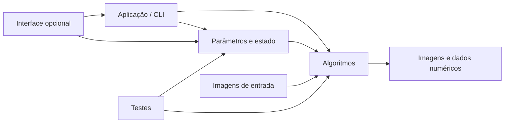
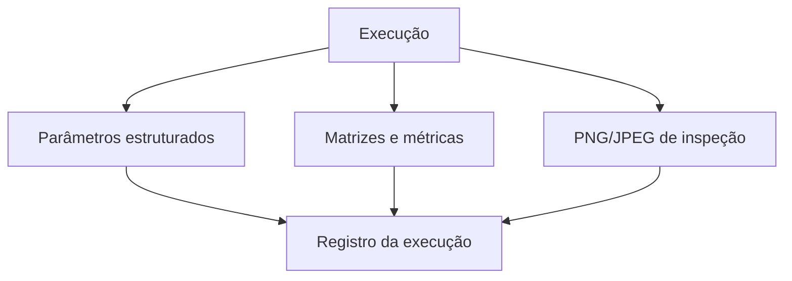
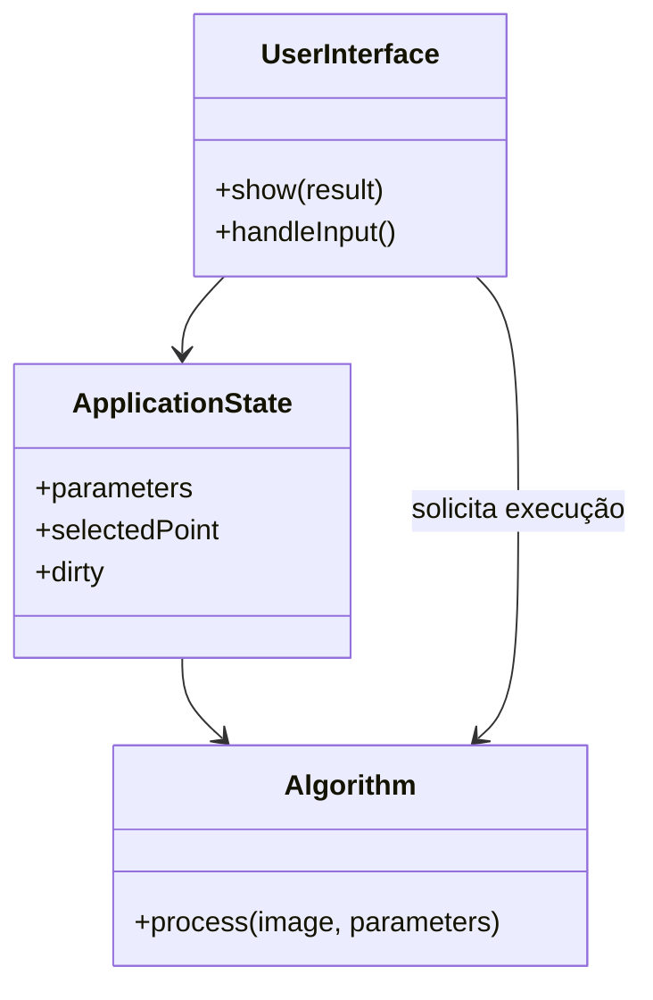

# Comparação didática entre C++, Java e Python {#language_comparison}

Esta página compara três caminhos possíveis para implementar os laboratórios de
Processamento de Imagens: C++, Java e Python. O objetivo não é declarar uma
linguagem universalmente superior, mas explicitar equivalências conceituais,
diferenças de infraestrutura e decisões que afetam correção, desempenho,
reprodutibilidade e clareza didática.

As implementações de referência deste repositório permanecem em C++20. Nas
entregas dos laboratórios, entretanto, poderão ser utilizadas C++, Java ou
Python, desde que sejam atendidas as restrições específicas de cada atividade,
a estrutura mínima de projeto, a persistência dos resultados e a separação
entre algoritmo, estado e interface.

> **Regra didática sobre acesso a pixels:** os estudantes podem usar acesso
> indexado oferecido pela linguagem e pelo binding. Em C++, é permitido usar
> `cv::Mat::at<T>(row, col)`; em Java, `Mat.get(row, col)` e
> `Mat.put(row, col, ...)`; em Python, indexação NumPy como
> `image[row, col]`. O uso dessas operações não autoriza chamar funções prontas
> que implementem diretamente o algoritmo exigido.

## Visão geral

| Aspecto | C++ | Java | Python |
|---|---|---|---|
| Binding principal | OpenCV C++ | OpenCV Java | `cv2` + NumPy |
| Representação central | `cv::Mat` | `org.opencv.core.Mat` | `numpy.ndarray` |
| Compilação | nativa | bytecode para JVM + biblioteca nativa | interpretação/bytecode + extensões nativas |
| Tipagem | estática e explícita | estática e explícita | dinâmica, com `dtype` explícito na matriz |
| Gerenciamento de memória | RAII e contagem de referências em `cv::Mat` | coleta de lixo para objetos Java e memória nativa no binding | contagem de referências/coleta de ciclos e buffers NumPy |
| Acesso por pixel | `at<T>` ou ponteiro por linha | `get`/`put` | indexação NumPy |
| Saturação | `cv::saturate_cast`, `std::clamp` | limitação explícita antes da conversão | `numpy.clip` antes de converter `dtype` |
| Persistência OpenCV | `cv::FileStorage` | `FileStorage`, conforme binding disponível | `cv2.FileStorage` |
| YAML genérico | bibliotecas como yaml-cpp | SnakeYAML/Jackson YAML | PyYAML ou ruamel.yaml |
| Testes | Catch2/CTest | JUnit | `unittest` ou pytest |
| Interface simples | HighGUI; Qt opcional | HighGui; JavaFX/Swing opcional | HighGUI; Qt/PySide/PyQt/Tkinter opcional |

## Organização de projeto

Uma organização mínima deve separar código-fonte, testes, imagens de entrada,
resultados e documentação. A nomenclatura exata varia, mas as responsabilidades
devem permanecer equivalentes.



### C++

```text
projeto/
├── CMakeLists.txt
├── include/
├── src/
├── apps/
├── tests/
├── images/
└── docs/
```

É recomendável expor interfaces públicas em `include/`, manter implementações
em `src/` e deixar cada executável em um diretório próprio de `apps/`.

### Java

```text
projeto/
├── pom.xml ou build.gradle
├── src/
│   ├── main/java/
│   ├── main/resources/
│   └── test/java/
├── images/
└── docs/
```

Maven ou Gradle deve declarar dependências, plugins de teste e tarefas de
execução. A biblioteca nativa do OpenCV precisa estar disponível para a JVM.

### Python

```text
projeto/
├── pyproject.toml
├── src/
│   └── pdi_labs/
├── tests/
├── images/
├── docs/
└── requirements.txt
```

O ambiente virtual deve ser reproduzível. Dependências podem ser registradas em
`pyproject.toml`, `requirements.txt` ou ambos, conforme a ferramenta adotada.

## Tipos numéricos

Processamento de imagens exige distinguir o tipo usado para armazenar o pixel do
tipo usado em cálculos intermediários.

| Finalidade | C++ | Java | Python/NumPy |
|---|---|---|---|
| pixel de 8 bits sem sinal | `std::uint8_t`, `uchar` | `byte` exige cuidado; normalmente usa-se `int` para cálculo | `numpy.uint8` |
| rótulo de componente | `std::int32_t`, `int` | `int` | `numpy.int32` |
| acumulação | `int`, `long long`, `double` | `int`, `long`, `double` | `numpy.int32`, `numpy.int64`, `numpy.float64` |
| kernel | `float` ou `double` | `float` ou `double` | `numpy.float32` ou `numpy.float64` |

A regra prática é ampliar o tipo antes da operação e reduzir somente após
aplicar a política de saturação ou normalização.

### Exemplo conceitual

```text
pixel armazenado -> tipo ampliado -> cálculo -> saturação -> tipo de saída
```

## Saturação

Saturação limita um valor ao intervalo representável pela imagem de destino.
Para uma imagem de 8 bits:

\[
g(x,y)=\min(255,\max(0,v(x,y))).
\]

### C++

```cpp
const int value = static_cast<int>(pixel) + offset;
const auto output = cv::saturate_cast<uchar>(value);
```

Também é possível usar `std::clamp(value, 0, 255)` antes da conversão.

### Java

```java
int value = pixel + offset;
int saturated = Math.max(0, Math.min(255, value));
```

Como `byte` em Java é assinado, os cálculos de intensidade devem usar `int`.
Ao ler dados brutos, pode ser necessário usar `value & 0xFF`.

### Python

```python
value = int(pixel) + offset
saturated = max(0, min(255, value))
```

Para arrays:

```python
result = numpy.clip(intermediate, 0, 255).astype(numpy.uint8)
```

Converter diretamente um valor fora do intervalo para `uint8` pode produzir
comportamento de módulo, não saturação. A limitação deve ser explícita.

## Representação de imagens

### C++: `cv::Mat`

`cv::Mat` armazena metadados e compartilha um buffer com contagem de
referências. Uma atribuição normalmente cria outra visão para os mesmos dados.

```cpp
cv::Mat shared = image;       // compartilha dados
cv::Mat independent = image.clone(); // cópia profunda
```

### Java: `Mat`

O objeto Java representa uma matriz mantida pelo binding nativo. Atribuir uma
referência Java não cria uma nova matriz.

```java
Mat shared = image;
Mat independent = image.clone();
```

Objetos `Mat` devem ter ciclo de vida previsível em aplicações extensas. Mesmo
com coleta de lixo, a memória relevante pode estar no lado nativo.

### Python: `numpy.ndarray`

O binding Python normalmente apresenta imagens como arrays NumPy.

```python
shared = image
view = image[:, :]
independent = image.copy()
```

Fatiamentos frequentemente produzem visões. Alterar uma visão pode alterar o
array original.

## Acesso pixel a pixel

A ordem conceitual deve ser sempre `linha, coluna`. Coordenadas gráficas
costumam ser escritas como `(x, y)`, mas matrizes são indexadas como
`(row, col)` ou `(y, x)`.

### C++

É permitido usar `at<T>` nos laboratórios:

```cpp
for (int row = 0; row < image.rows; ++row) {
    for (int col = 0; col < image.cols; ++col) {
        const uchar pixel = image.at<uchar>(row, col);
        output.at<uchar>(row, col) = pixel;
    }
}
```

Para três canais:

```cpp
const cv::Vec3b bgr = image.at<cv::Vec3b>(row, col);
```

O tipo usado em `at<T>` deve corresponder ao tipo e ao número de canais da
matriz.

### Java

```java
for (int row = 0; row < image.rows(); ++row) {
    for (int col = 0; col < image.cols(); ++col) {
        double[] pixel = image.get(row, col);
        output.put(row, col, pixel);
    }
}
```

`get` e `put` podem criar arrays temporários e têm custo significativo em loops
grandes. Para desempenho, pode-se transferir uma linha ou o buffer inteiro para
um array Java, processá-lo e escrevê-lo de volta, desde que a lógica permaneça
pixel a pixel.

### Python

```python
for row in range(image.shape[0]):
    for col in range(image.shape[1]):
        pixel = image[row, col]
        output[row, col] = pixel
```

Esse código é didaticamente explícito, mas loops Python puros são lentos.
Vetorização NumPy é adequada quando a atividade permitir operações prontas ou
expressões matriciais equivalentes.

## Gerenciamento de memória

### C++

- RAII libera objetos automaticamente ao sair do escopo;
- `cv::Mat` usa contagem de referências para o buffer;
- ponteiros e referências exigem atenção ao tempo de vida;
- `clone()` e `copyTo()` criam cópias independentes;
- buffers temporários grandes devem ser reutilizados quando possível.

### Java

- a coleta de lixo gerencia objetos Java;
- `Mat` encapsula recursos nativos;
- grandes quantidades de matrizes temporárias pressionam memória nativa;
- escopos claros e liberação explícita, quando oferecida pelo binding, tornam o
  comportamento mais previsível;
- copiar referências não duplica pixels.

### Python

- objetos usam contagem de referências e coleta de ciclos;
- arrays NumPy podem compartilhar o mesmo buffer;
- `copy()` cria dados independentes;
- operações vetorizadas podem criar temporários grandes;
- fatiamentos e `reshape` podem ser visões ou cópias, dependendo da continuidade.

## Referências, visões e cópias

| Operação | C++ | Java | Python |
|---|---|---|---|
| outra referência ao mesmo objeto/dado | `cv::Mat b = a;` | `Mat b = a;` | `b = a` |
| cópia profunda | `a.clone()` | `a.clone()` | `a.copy()` |
| região de interesse | `a(rect)` | `a.submat(rect)` | `a[y0:y1, x0:x1]` |
| risco principal | alterar dados compartilhados | manter recurso nativo vivo | alterar uma visão sem perceber |

Nos testes, uma forma simples de detectar compartilhamento indesejado é
modificar a suposta cópia e verificar se a entrada permaneceu inalterada.

## Tratamento de erros

### C++

- exceções `cv::Exception` para falhas do OpenCV;
- `std::invalid_argument` para parâmetros inválidos;
- `std::runtime_error` para falhas de execução;
- validação antecipada de dimensões, canais, tipo e caminhos.

```cpp
if (image.empty()) {
    throw std::invalid_argument("A imagem de entrada está vazia.");
}
```

### Java

- exceções do binding OpenCV;
- `IllegalArgumentException` para contrato inválido;
- `IOException` para persistência;
- mensagens devem incluir o parâmetro ou arquivo problemático.

```java
if (image.empty()) {
    throw new IllegalArgumentException("A imagem de entrada está vazia.");
}
```

### Python

- `ValueError` para parâmetros;
- `FileNotFoundError` para caminhos;
- `RuntimeError` para falhas operacionais;
- não usar `assert` como validação de entrada do usuário.

```python
if image is None or image.size == 0:
    raise ValueError("A imagem de entrada está vazia.")
```

## OpenCV em cada linguagem

As três opções chamam implementações nativas do OpenCV, mas a ergonomia varia.

### C++

```cpp
#include <opencv2/core.hpp>
#include <opencv2/imgcodecs.hpp>

cv::Mat image = cv::imread(path, cv::IMREAD_COLOR);
```

O CMake normalmente usa `find_package(OpenCV REQUIRED ...)` e vincula os
módulos necessários.

### Java

```java
System.loadLibrary(Core.NATIVE_LIBRARY_NAME);
Mat image = Imgcodecs.imread(path, Imgcodecs.IMREAD_COLOR);
```

O projeto precisa localizar o arquivo JAR e a biblioteca nativa compatível com
sistema operacional, arquitetura e versão do OpenCV.

### Python

```python
import cv2 as cv

image = cv.imread(path, cv.IMREAD_COLOR)
```

O pacote Python inclui o binding, mas variantes com e sem interface gráfica não
devem ser misturadas no mesmo ambiente.

## Compilação e dependências

### C++

- CMake e compilador compatível com C++20;
- OpenCV instalado para o mesmo toolchain;
- build fora da árvore de fontes;
- CTest/Catch2 para testes.

### Java

- JDK;
- Maven ou Gradle;
- JAR do OpenCV;
- biblioteca nativa no `java.library.path` ou carregada por caminho explícito;
- JUnit para testes.

### Python

- Python compatível;
- ambiente virtual;
- `opencv-python` ou distribuição equivalente;
- NumPy;
- arquivo de dependências reproduzível;
- `unittest` ou pytest.

Uma entrega deve documentar versões, comandos de instalação, comando de teste e
comando de execução.

## Testes

Os mesmos princípios valem nas três linguagens:

1. usar matrizes pequenas com resultado calculável manualmente;
2. testar tipos, dimensões e canais;
3. verificar pixels de borda e interior;
4. testar saturação inferior e superior;
5. manter testes sem janelas por padrão;
6. separar testes numéricos de demonstrações visuais;
7. comparar com OpenCV apenas quando a atividade permitir.

### Exemplos mínimos

C++ com Catch2:

```cpp
REQUIRE(result.at<uchar>(0, 0) == 255);
```

Java com JUnit:

```java
assertEquals(255.0, result.get(0, 0)[0]);
```

Python com `unittest`:

```python
self.assertEqual(255, int(result[0, 0]))
```

Para matrizes completas, preferir comparações exatas em operações inteiras e
tolerâncias explícitas em operações de ponto flutuante.

## Persistência estruturada de parâmetros e matrizes

Uma execução reproduzível deve registrar:

- identificador do algoritmo;
- parâmetros;
- tipo, dimensões e canais das entradas;
- métricas;
- caminhos dos artefatos visuais;
- matrizes numéricas quando forem relevantes;
- versão do formato.



### YAML e `FileStorage`

| Necessidade | C++ | Java | Python |
|---|---|---|---|
| API OpenCV | `cv::FileStorage` | `FileStorage`, quando exposto pelo binding adotado | `cv2.FileStorage` |
| YAML genérico | yaml-cpp | SnakeYAML ou Jackson YAML | PyYAML ou ruamel.yaml |
| JSON genérico | nlohmann/json, Boost.JSON | Jackson, Gson | módulo `json` |
| CSV | biblioteca padrão ou biblioteca externa | `java.nio`/biblioteca CSV | módulo `csv`, pandas opcional |

`FileStorage` é adequado para matrizes OpenCV e estruturas simples. Bibliotecas
YAML genéricas são mais adequadas quando o formato precisa ser independente do
OpenCV ou consumido por diferentes ferramentas.

### C++ com `cv::FileStorage`

```cpp
cv::FileStorage storage("run.yml", cv::FileStorage::WRITE);
storage << "threshold" << threshold;
storage << "kernel" << kernel;
```

### Java

```java
Map<String, Object> parameters = new LinkedHashMap<>();
parameters.put("threshold", threshold);
parameters.put("connectivity", connectivity);
```

O mapa pode ser serializado com SnakeYAML ou Jackson YAML. Para matrizes, deve-se
definir um esquema com `rows`, `cols`, `type` e `data`, ou usar a API
`FileStorage` disponível na distribuição escolhida.

### Python

```python
parameters = {
    "threshold": threshold,
    "connectivity": connectivity,
}
```

Com YAML genérico, arrays NumPy devem ser convertidos para listas ou persistidos
separadamente em formato apropriado. Com `cv2.FileStorage`, matrizes OpenCV/NumPy
podem ser gravadas no formato suportado pelo OpenCV.

## Visualizações e artefatos numéricos

PNG e JPEG são úteis para inspeção, mas não substituem dados numéricos.

| Artefato | Finalidade |
|---|---|
| PNG/JPEG | inspeção visual e relatório |
| YAML/JSON | parâmetros, metadados e métricas |
| CSV | tabelas e séries para análise |
| matriz estruturada | rótulos, kernels, respostas assinadas |
| log textual | diagnóstico e rastreabilidade |

Uma matriz de rótulos `CV_32SC1`, por exemplo, não deve ser preservada somente
como imagem colorida. A imagem colorida é uma visualização; os rótulos inteiros
são o artefato numérico.

## Interfaces interativas equivalentes

A interface é opcional e não deve conter a implementação principal do
algoritmo.

| Recurso | C++ | Java | Python |
|---|---|---|---|
| janela simples | `cv::imshow` | `HighGui.imshow` | `cv.imshow` |
| teclado | `cv::waitKey` | `HighGui.waitKey` | `cv.waitKey` |
| mouse | `cv::setMouseCallback` | suporte varia no binding; JavaFX/Swing pode intermediar | `cv.setMouseCallback` |
| trackbar | `cv::createTrackbar` | pode exigir wrapper próprio ou UI Java | `cv.createTrackbar` |
| controles ricos | backend Qt opcional | JavaFX/Swing | PySide/PyQt/Tkinter |
| interface web | externa ao núcleo | Spring/JavaFX WebView, se justificado | Streamlit/Gradio, se permitido |

A disponibilidade exata de callbacks e controles no binding Java pode variar.
Quando HighGUI não expuser o mecanismo necessário, a interface pode ser feita
com JavaFX ou Swing, mantendo o algoritmo independente.

## Trackbars, mouse e teclado

### Trackbar

Uma trackbar altera um parâmetro, mas não deve executar lógica duplicada.

```text
callback -> atualiza estado -> solicita reprocessamento -> algoritmo -> visualização
```

### Mouse

Eventos do mouse podem selecionar ponto, região ou componente. A conversão entre
coordenadas da janela e coordenadas da matriz deve ser explícita.

### Teclado

Teclas devem controlar ações de alto nível, por exemplo:

- `Esc` ou `q`: sair;
- `s`: salvar;
- `r`: restaurar parâmetros;
- `n`: avançar visualização.

A lógica do algoritmo não deve depender diretamente de códigos de tecla.

## Separação entre algoritmo, estado e interface



- **Algoritmo:** função ou classe determinística, sem janelas.
- **Estado:** parâmetros atuais e seleção do usuário.
- **Interface:** converte eventos em alterações de estado e apresenta saídas.
- **Persistência:** registra parâmetros e artefatos sem depender da interface.

Essa divisão permite testar o algoritmo sem abrir janelas e substituir HighGUI
por Qt, JavaFX, Swing, PySide ou outra camada.

## Desempenho

### C++

Tende a oferecer o menor overhead em loops explícitos e maior controle de
alocação. `at<T>` é apropriado didaticamente; ponteiros por linha ou iteradores
podem ser usados em otimizações posteriores.

### Java

Loops compilados pela JVM podem apresentar bom desempenho após aquecimento, mas
chamadas repetidas `Mat.get`/`Mat.put` atravessam a fronteira Java/nativo. A
transferência por linha ou buffer reduz esse custo.

### Python

Loops Python por pixel são os mais lentos entre as três opções. NumPy e OpenCV
executam operações vetorizadas em código nativo, mas podem contrariar o objetivo
de implementar o algoritmo explicitamente. Nos laboratórios, clareza e
correção têm prioridade; medições devem distinguir tempo do algoritmo, leitura,
escrita e interface.

## Armadilhas comuns

### C++

- usar `at<T>` com tipo incompatível;
- confundir `(x, y)` com `(row, col)`;
- acreditar que atribuição de `cv::Mat` cria cópia profunda;
- converter para `uchar` antes da saturação;
- manter referência para matriz temporária;
- misturar algoritmo com callbacks de interface.

### Java

- esquecer que `byte` é assinado;
- carregar JAR e biblioteca nativa de versões diferentes;
- criar `double[]` novo para cada pixel sem avaliar custo;
- assumir que coleta de lixo libera imediatamente memória nativa;
- comparar matrizes apenas por referência;
- colocar persistência e interface dentro da classe do algoritmo.

### Python

- permitir overflow ou wrap-around de `uint8`;
- modificar uma visão pensando que é cópia;
- usar loops Python grandes sem medir;
- instalar simultaneamente variantes conflitantes do pacote OpenCV;
- serializar `numpy.ndarray` diretamente em YAML genérico sem esquema;
- depender de notebooks sem entregar projeto executável e código-fonte.

## Equivalências conceituais

| Conceito | C++ | Java | Python |
|---|---|---|---|
| matriz de imagem | `cv::Mat` | `Mat` | `numpy.ndarray` |
| vazio | `image.empty()` | `image.empty()` | `image is None` ou `image.size == 0` |
| linhas | `image.rows` | `image.rows()` | `image.shape[0]` |
| colunas | `image.cols` | `image.cols()` | `image.shape[1]` |
| canais | `image.channels()` | `image.channels()` | `1` ou `image.shape[2]` |
| cópia profunda | `clone()` | `clone()` | `copy()` |
| pixel cinza | `at<uchar>(r,c)` | `get(r,c)[0]` | `image[r,c]` |
| pixel BGR | `at<cv::Vec3b>(r,c)` | `get(r,c)` | `image[r,c,:]` |
| saturação | `saturate_cast` | `min`/`max` | `clip` |
| janela | `imshow` | `HighGui.imshow` | `cv.imshow` |
| teclado | `waitKey` | `HighGui.waitKey` | `cv.waitKey` |
| YAML OpenCV | `FileStorage` | `FileStorage` conforme binding | `cv2.FileStorage` |
| teste unitário | Catch2 | JUnit | `unittest`/pytest |

## Critérios comuns para as entregas

Independentemente da linguagem, a entrega deve conter:

1. projeto reproduzível;
2. código-fonte;
3. instruções de instalação, build e execução;
4. testes automatizados;
5. imagens oficiais de entrada;
6. resultados visuais;
7. parâmetros e artefatos numéricos estruturados;
8. mini-relatório;
9. identificação da linguagem, versão e dependências;
10. declaração das funções prontas utilizadas.

A avaliação considera o mesmo algoritmo e os mesmos resultados esperados. O
rigor pode variar na organização idiomática, mas não na correção matemática, na
rastreabilidade ou no atendimento às restrições do laboratório.

## Referências técnicas

- documentação oficial do OpenCV para C++, Java e Python;
- referência de `cv::Mat` e das classes `Mat`;
- documentação do módulo HighGUI;
- documentação de `cv::FileStorage`;
- documentação do NumPy para tipos, visões e cópias;
- documentação do JUnit, Catch2 e `unittest`;
- documentação das bibliotecas YAML adotadas por cada projeto.
